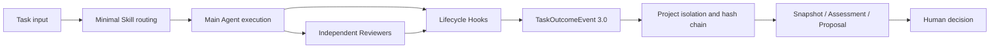

<!-- Generated from locales/en/README.md; edit that source and run scripts/documentation.py sync. -->

<p align="right">
  <a href="https://jimmyvgdy.github.io/codex-long-term-assistant-skills/zh-CN/">Chinese</a> · <strong>English</strong>
</p>

V7.8.0 adds the C01-C25 AUTO capability registry, one-time first-use onboarding, cancellable and recoverable scan state, scoped-review fingerprints, and per-feature `doctor` / read-only `inventory` recovery. Missing optional context keeps ordinary work on BASIC, and neither AUTO nor FULL grants external-action authority.

# Codex Cross-Project Engineering Assistant

<p align="center">
  
</p>

<p align="center">
  A cross-project engineering framework for Codex: Skill routing, independent multi-agent review, recoverable task memory, lifecycle events, and controlled evolution.
</p>

<p align="center">
  <a href="https://github.com/JimmyVGDY/codex-long-term-assistant-skills/actions/workflows/ci.yml"></a>
  <a href="https://jimmyvgdy.github.io/codex-long-term-assistant-skills/"></a>
  <a href="https://github.com/JimmyVGDY/codex-long-term-assistant-skills/releases/latest"></a>
  <a href="LICENSE"></a>
  
  
</p>

V7.6.2 restored the non-blocking message and Stop boundary; V7.7.0 added Operation v2; and V7.7.1 moved the compatibility window to Codex CLI 0.154.0 while fixing disabled-gate PostTool reconciliation. V7.8.0 adds AUTO/BASIC levels, first-scan consent, and open-source installation recovery. The gate remains off by default, and capability level is neither semantic correctness nor authority.

**Quick links:** [Bilingual documentation](https://jimmyvgdy.github.io/codex-long-term-assistant-skills/) · [Downloads](#downloads) · [Usage example](#reproducible-usage-example) · [Compatibility](#compatibility-matrix) · [Installation](#five-minute-upgrade) · [Documentation](#documentation-and-collaboration)

Use the assistant directly after installation; ordinary work does not require learning Profiles, indexes, or ledgers first. The first full scan is optional. Declining it, leaving it unanswered, or losing auxiliary storage keeps the current-source BASIC path available. For recovery, use `doctor`, read-only `inventory`, and canonical `recover` in that order; each reports the affected feature, what still works, and the next action.

## Downloads

| Distribution | Interface | Download |
| --- | --- | --- |
| `Codex-Skills-V7.8.0-zh-CN.zip` | Chinese | [Download zh-CN package](https://github.com/JimmyVGDY/codex-long-term-assistant-skills/releases/download/v7.8.0/Codex-Skills-V7.8.0-zh-CN.zip) |
| `Codex-Skills-V7.8.0-en.zip` | English | [Download English package](https://github.com/JimmyVGDY/codex-long-term-assistant-skills/releases/download/v7.8.0/Codex-Skills-V7.8.0-en.zip) |

[Open the latest Release, checksums, and build witnesses](https://github.com/JimmyVGDY/codex-long-term-assistant-skills/releases/latest)

## Core capabilities

- Ten engineering Skills with minimal, progressive routing for the active task.
- The C01-C25 registry defaults to AUTO/BASIC. A missing prerequisite degrades only that capability, while explicit OFF and task risk are evaluated separately.
- A first full scan queues only after an explicit persisted choice. Decline, no reply, cancellation, persistence failure, and late workers have separate states.
- Seven logically read-only Reviewers with no hard-coded model or reasoning effort.
- <!-- cp-fact:hooks.en -->8 registered Hook entry points: `UserPromptSubmit`, `PreToolUse`, `PostToolUse`, `SubagentStart`, `SubagentStop`, `Stop`, `Interrupt`, `SessionEnd`.<!-- /cp-fact --> UserPromptSubmit is asynchronous observation, Stop is neutral, and Interrupt remains host-controlled; PreToolUse/PostToolUse advance Operation v2 only for the verified canonical `apply_patch` contract.
- TaskOutcomeEvent 3.0 with `project_id + repo_fingerprint` isolation and a separate continuous hash chain.
- Recoverable checkpoints, delayed SessionEnd sealing, event archives, and cross-project health summaries.
- Separate package routing regression from real-host routing acceptance, binding host evidence to raw final-report SHA-256 digests.
- Evaluate evidence sufficiency per evolution signal instead of globally blocking on unrelated missing telemetry.
- Controlled proposals fixed at `execution_authorization=NONE`, without implementation authority.



## Reproducible usage example

The following input, flow, and inspectable outcome show a typical read-only task. This is an illustrative usage example, not runtime evidence for the current session.

**Task input**

```text
Inspect the installer upgrade path in the current repository without modifying files.
Select a Reviewer according to actual risk, and separate confirmed facts, inferences,
and unverified items.
```

**Expected flow**

```text
Task input
  -> route engineering-quality-delivery
  -> read the installer, manifests, tests, and upgrade documentation
  -> start a logically read-only Reviewer when justified by risk
  -> deduplicate and reconcile Reviewer findings
  -> report evidence, risks, and unverified boundaries
```

The lifecycle can produce `TURN_OPENED -> SUBAGENT_STARTED -> SUBAGENT_STOPPED -> TASK_COMPLETED`; `SessionEnd` then enters the delayed sealing path. Model evidence stays separated into three fields:

```ini
dispatch_policy_status = PASS
host_model_identity = NOT_COLLECTED
```

Here, `requested_model_policy=PASS` only proves that automatic dispatch did not request a configuration above Terra High. It does not attest to the model that actually ran.

## Compatibility matrix

| Environment or mode | Current role | Existing validation level | Boundary |
| --- | --- | --- | --- |
| Native Windows Codex CLI 0.154.0 + Plugin | Current real-host anchor | The V7.8.0 source candidate covers AUTO, onboarding, migration, diagnostics, and Operation v2 regression | Account installation, restart, and fresh-task loading require separate post-release readback |
| Windows + eleven pinned stable Codex releases | Frozen compatibility window | The 11/11 official async, Pre/Post schema, and result-response source evidence remains bound and requires release readback | The V7.8.0 cross-version real-host matrix still requires CI readback |
| Windows / Ubuntu GitHub matrix | Release gate | The workflow is configured for both systems on Python 3.11/3.13 plus eleven-version replay | V7.8.0 CI results require readback after push and tag |
| standalone mode | Explicit fallback | Local installation structure, inventory, non-Git BASIC, and regression coverage | V7.8.0 account installation has not run and does not establish Plugin host compatibility |
| macOS | Unverified | No current CI or host-acceptance evidence | Status remains `UNVERIFIED` |

The minimum Python version is 3.11; public CI is configured to validate both 3.11 and 3.13 on Windows and Ubuntu. For any other environment combination, run `doctor`, `dry-run`, and `verify` before deciding its usable status.

The V7.8.0 window is `0.154.0`, `0.153.4`, `0.153.3`, `0.153.2`, `0.153.1`, `0.153.0`, `0.152.1`, `0.152.0`, `0.151.0`, `0.150.1`, and `0.150.0`. Patch releases count independently; future, prerelease, and other out-of-window hosts are not admitted automatically.

## Five-minute upgrade

1. Download one language archive and extract it into a temporary directory.
2. Run the following commands from the extracted package root:

```powershell
python scripts\package_manager.py doctor
python scripts\package_manager.py install --scope user --mode plugin --dry-run
python scripts\package_manager.py install --scope user --mode plugin
python scripts\package_manager.py verify --scope user --mode plugin
codex plugin list --json
```

3. The upgrade is established only when Plugin readback reports `installed=true`, `enabled=true`, and `version=7.8.0`, schema-3 host state is `HOST_COMPATIBLE`, and every Manifest-declared legacy Skill directory is absent.

The installer detects an existing version, creates a bounded backup, rejects link and reparse-point risks, preserves unknown files, and removes only Manifest-declared legacy Skill directories: the three V7 domain replacements plus the previously deprecated Vue Skill. See [Installation and recovery](docs/operations/INSTALLATION_RECOVERY.en.md) and the [User guide](docs/USER_GUIDE.en.md).

## Model evidence boundary

```ini
dispatch_policy_status = PASS
host_model_identity = NOT_COLLECTED
```

Ordinary Hook payloads do not provide a trusted, correlatable runtime-model attestation. A requested Luna or Terra profile is not proof of the model that actually ran. The automatic cost ladder is:

```text
luna-low -> luna-medium -> terra-medium -> terra-high
```

Automatic dispatch rejects Sol, `xhigh`, `max`, `ultra`, and every configuration above `gpt-5.6-terra + high`.

## Documentation and collaboration

- [Documentation hub](docs/README.en.md): installation, configuration, architecture, model policy, validation, and history.
- [Contributing guide](.github/CONTRIBUTING.en.md): branches, commits, bilingual coverage, and validation.
- [Security policy](.github/SECURITY.en.md): vulnerability reporting and sensitive-information handling.
- [Code of conduct](.github/CODE_OF_CONDUCT.en.md): baseline boundaries for public collaboration.
- [Changelog](CHANGELOG.en.md) · [V7.8.0 release notes](docs/releases/v7.8.0/RELEASE_NOTES.en.md)

## Local validation

```powershell
python scripts\localization-audit.py --strict
python scripts\validate-package.py
```

Release builds use fixed timestamps, stable ordering, and SHA-256 witnesses. The source repository and release archive are separate evidence layers: repository CI validates a commit, while Release assets and witnesses validate downloadable artifacts.

## Release provenance

The `Release Candidate and Provenance` workflow validates version tags, checks the source on Windows and Ubuntu, builds both reproducible ZIP files, and uses GitHub Artifact Attestations to generate signed provenance for the actual ZIP digests. Tag runs create drafts only; they never publish automatically or overwrite an existing Release.

```shell
gh attestation verify Codex-Skills-V7.8.0-en.zip --repo OWNER/REPOSITORY
```

See [Release automation and artifact provenance](docs/releases/RELEASE_AUTOMATION.en.md) for the complete gates and new-version procedure.

## Safety boundaries

- No automatic Skill, Reviewer, model-route, global-configuration, or business-repository modification.
- No automatic proposal acceptance or execution.
- No automatic commit, push, deployment, restart, production operation, or business-data write.
- Evidence records facts and never grants authority.
- Raw prompts, complete responses, source bodies, diffs, tokens, cookies, API keys, and credentials are not stored by default.

Licensed under Apache-2.0. See [LICENSE](LICENSE).

Reuse guidance: [Capability index](docs/CAPABILITY_INDEX.en.md) · [Acceptance protocol](docs/COMPONENT_REUSE_ACCEPTANCE.en.md).

V7.6.0 post-release readback (checked at 2026-09-09 04:04:02 UTC): the [release workflow](https://github.com/JimmyVGDY/codex-long-term-assistant-skills/actions/runs/34304636222), [main-branch CI](https://github.com/JimmyVGDY/codex-long-term-assistant-skills/actions/runs/34304540318), and [documentation deployment](https://github.com/JimmyVGDY/codex-long-term-assistant-skills/actions/runs/34304540320) passed for commit `26d013fa824fa148a839d30aaedd22f3744e8bbf`. This record belongs to that tag and verification time, not subsequent changes, and does not establish cancellation support on every host.
