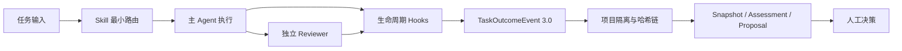

<p align="right">
  <strong>简体中文</strong> · <a href="README.en.md">English</a>
</p>

V7.9.0 提供基础安装即用和按需增强运行时：普通工程任务可直接开始，Hook、长期状态、预算和受控写入只在需要时接入。

# Codex 跨项目长期技术助手

<p align="center">
  
</p>

<p align="center">
  面向 Codex 的跨项目工程协作框架：Skill 路由、多 Agent 独立复审、可恢复任务记忆、生命周期事件与受控演进。
</p>

<p align="center">
  <a href="https://github.com/JimmyVGDY/codex-long-term-assistant-skills/actions/workflows/ci.yml"></a>
  <a href="https://jimmyvgdy.github.io/codex-long-term-assistant-skills/"></a>
  <a href="https://github.com/JimmyVGDY/codex-long-term-assistant-skills/releases/latest"></a>
  <a href="LICENSE"></a>
  
  
</p>

V7.6.2 已恢复消息与 Stop 非阻断边界；V7.7.0 新增 Operation v2；V7.7.1 将兼容窗口前移到 Codex CLI 0.154.0。V7.9.0 保留这些安全边界，并将基础 Skill 与可选增强运行时解耦；门禁仍默认关闭，能力档位不代表业务语义正确或权限已授予。

**快速入口：** [双语文档站](https://jimmyvgdy.github.io/codex-long-term-assistant-skills/) · [下载](#下载) · [使用示例](#可复现使用示例) · [兼容矩阵](#兼容矩阵) · [安装](#首次安装与升级) · [文档](#文档与协作)

安装后可直接使用，普通任务不需要先理解 Profile、索引或台账。首次全扫可以跳过；拒绝、未回答或辅助存储不可用时，助手仍按当前源码与基础能力继续。需要排障时依次使用 `doctor`、只读 `inventory` 和规范 `recover`，它们会说明受影响功能、当前还能做什么和唯一下一步。

## 下载

| 发行包 | 适用界面 | 下载 |
| --- | --- | --- |
| `Codex-Skills-V7.9.0-zh-CN.zip` | 简体中文 | [下载中文安装包](https://github.com/JimmyVGDY/codex-long-term-assistant-skills/releases/download/v7.9.0/Codex-Skills-V7.9.0-zh-CN.zip) |
| `Codex-Skills-V7.9.0-en.zip` | English | [Download English package](https://github.com/JimmyVGDY/codex-long-term-assistant-skills/releases/download/v7.9.0/Codex-Skills-V7.9.0-en.zip) |

[查看最新 Release、校验和与构建见证](https://github.com/JimmyVGDY/codex-long-term-assistant-skills/releases/latest)

## 两步开始

1. 解压安装包后，运行原生基础安装入口；它不需要本包 Python runtime 或 API Key。

   ```powershell
   .\scripts\install-base.ps1
   ```

   ```sh
   ./scripts/install-base.sh
   ```

2. 直接描述工程任务，例如：

   ```text
   修复当前仓库失败的验证，并运行最小相关测试。
   审查我在这个分支的改动，检查兼容与安全风险。
   继续之前的任务；先确认已改内容和仍需验证的部分。
   ```

基础 Plugin 只加载十个 Skill，不启动 Hook、Worker、Profile、索引或预算台账。这些属于按需启用的增强能力，不是普通任务前提。

## 可选增强

需要可恢复的长期状态、Hook、索引、独立 Reviewer、强制预算或受控写入时，再运行现有 `install-user` 入口。增强安装复用既有备份、事务、验证和恢复；已受管增强 state 不会被基础入口降级。

## 核心能力

- 10 个工程 Skill，按当前任务最小充分路由并渐进加载。
- C01-C25 能力注册表默认 AUTO/BASIC；单项缺条件只降级该项，显式 OFF 和任务风险分别计算。
- 首次全扫只在明确选择并成功读回后排队；拒绝、未答、取消、保存失败和 Worker 晚到都有独立状态。
- 4 个稳定主领域：通用后端、通用前端、通用 AI、数据中间件基础设施；语言和框架作为按需 Reference。
- 7 个逻辑只读 Reviewer，定义文件不写死模型或推理强度。
- 增强安装登记 <!-- cp-fact:hooks.zh -->8 个注册 Hook 入口：`UserPromptSubmit`、`PreToolUse`、`PostToolUse`、`SubagentStart`、`SubagentStop`、`Stop`、`Interrupt`、`SessionEnd`。<!-- /cp-fact -->基础 Plugin 不登记 Hook；增强中的 UserPromptSubmit 为异步观察，Stop 返回中性响应，Interrupt 保持宿主控制。
- TaskOutcomeEvent 3.0、`project_id + repo_fingerprint` 双重隔离与独立连续哈希链。
- 可恢复检查点、延迟 SessionEnd 封印、事件归档与跨项目健康概览。
- 包级路由回归与真实宿主路由验收分层记录；宿主证据绑定原始最终报告的 SHA-256。
- 演进候选按信号类型分别检查所需证据，不再因无关遥测缺失而全局阻断。
- `execution_authorization=NONE` 的受控优化提案，不授予实施权限。



## 可复现使用示例

以下内容展示一次典型只读任务的输入、流程和可检查结果；它是使用示例，不是当前会话的运行证明。

**任务输入**

```text
检查当前仓库的安装器升级路径，只读分析，不修改文件；
按风险选择 Reviewer，并区分已确认事实、推断和未验证项。
```

**预期流程**

```text
任务输入
  -> 路由 engineering-quality-delivery
  -> 读取安装器、清单、测试与升级文档
  -> 按实际风险启动逻辑只读 Reviewer
  -> 汇总并去重 Reviewer 发现
  -> 输出证据、风险和未验证边界
```

生命周期可形成 `TURN_OPENED -> SUBAGENT_STARTED -> SUBAGENT_STOPPED -> TASK_COMPLETED` 事件序列；会话结束后由 `SessionEnd` 进入延迟封印流程。V7.6.0 只证明派发前策略符合批准档位与 Terra High 上限，不读取、不推断、不保存或导出宿主实际使用的模型与推理强度。

## 兼容矩阵

| 环境或模式 | 当前定位 | 已有验证层级 | 边界 |
| --- | --- | --- | --- |
| Windows 原生 Codex CLI 0.154.0 + Plugin | 当前实机锚点 | V7.9.0 账户安装、`verify` 与项目外新 CLI 任务读回通过 | Desktop 重启后的新会话未验证 |
| Windows + 11 个固定 Codex 稳定版 | 冻结兼容窗口 | 11/11 官方 async、Pre/Post schema 与成功结果响应源码证据受注册表约束 | 跨版本真实宿主矩阵未逐台验收 |
| Windows / Ubuntu GitHub 矩阵 | 发布门禁 | 工作流配置为双系统 Python 3.11/3.13 验证与 11 版本重放 | 本次发布的远端 CI 结果单独以 Actions 页面为准 |
| standalone 模式 | 显式兼容模式 | 本地安装结构、inventory、非 Git BASIC 和回归测试覆盖 | 未作为本次账户 Plugin 验收替代 |
| macOS | 未验证 | 无当前 CI 或宿主验收证据 | 状态保持 `UNVERIFIED` |

Python 最低版本为 3.11；公开 CI 配置为在 Windows 与 Ubuntu 上验证 3.11 和 3.13。其他环境组合应先执行 `doctor`、`dry-run` 和 `verify`，再判断可用状态。

V7.9.0 窗口为 `0.154.0`、`0.153.4`、`0.153.3`、`0.153.2`、`0.153.1`、`0.153.0`、`0.152.1`、`0.152.0`、`0.151.0`、`0.150.1`、`0.150.0`。未来版、预发布版和窗口外版本不会自动接纳。

V7.6.0 增加有界外部能力索引与可选流程门禁。V7.6.2 迁移补丁不再把旧 GateTask 回执当作原生写入授权；V7.7.1 把兼容锚点前移到 Codex CLI 0.154.0 并修复停用门禁的 PostTool 对账。门禁默认关闭，流程证据也不代表业务语义正确；发行工作流只创建草稿。

## 首次安装与升级

首次安装使用上方基础入口。需要启用增强能力，或升级既有 V7 受管安装时，在解压后的包根目录依次执行：

```powershell
python scripts\package_manager.py doctor
python scripts\package_manager.py install --scope user --mode plugin --dry-run
python scripts\package_manager.py install --scope user --mode plugin
python scripts\package_manager.py verify --scope user --mode plugin
codex plugin list --json
```

增强安装只有在 Plugin 读回 `installed=true`、`enabled=true`、目标发行版本、兼容宿主快照且旧领域 Skill 不再发现时才成立。`doctor` 与 `status` 默认说明可继续的能力、受影响项、原因与唯一下一步；完整机器记录使用 `--json`。

安装器会识别已有版本、备份并移除受管旧 Skill、拒绝链接与 Reparse Point 风险，并保留未知文件。完整流程见 [安装与恢复](docs/operations/INSTALLATION_RECOVERY.md) 和 [V7.6 使用指南](docs/USER_GUIDE.md)。

## 派发策略与模型身份隐私边界

Agent 只使用批准派发档位、permit 引用与预留成本治理子任务；宿主实际模型身份和推理强度不纳入事件、预算、Reviewer、Evolution 或发布证明。自动成本阶梯为：

```text
luna-low -> luna-medium -> terra-medium -> terra-high
```

自动流程拒绝 Sol、`xhigh`、`max`、`ultra` 及任何超过 `gpt-5.6-terra + high` 的配置。

## 文档与协作

- [文档中心](docs/README.md)：安装、配置、架构、模型策略、验证与历史资料。
- [贡献指南](.github/CONTRIBUTING.md)：分支、提交、双语覆盖与验证方式。
- [安全策略](.github/SECURITY.md)：漏洞报告边界与敏感信息处理。
- [行为准则](.github/CODE_OF_CONDUCT.md)：公共协作的基本边界。
- [版本记录](CHANGELOG.md) · [V7.9.0 发行说明](docs/releases/v7.9.0/RELEASE_NOTES.md)

## 本地验证

```powershell
python scripts\localization-audit.py --strict
python scripts\validate-package.py
```

发行构建采用固定时间戳、稳定排序和 SHA-256 见证。源码仓库与发行安装包是不同证据层：仓库 CI 证明当前提交，Release 附件及其见证证明可下载产物。

## 发行来源证明

`Release Candidate and Provenance` 工作流会校验版本标签、在 Windows 与 Ubuntu 上验证源码、构建两个可复现 ZIP，并通过 GitHub Artifact Attestations 为实际 ZIP 摘要生成签名来源证明。公开 Release 由受权操作创建并单独读回。

```shell
gh attestation verify Codex-Skills-V7.9.0-zh-CN.zip --repo OWNER/REPOSITORY
```

完整门禁和新版本发布步骤见 [Release 自动化与制品来源证明](docs/releases/RELEASE_AUTOMATION.md)。

## 安全边界

- 不自动修改 Skill、Reviewer、模型路由、全局配置或业务仓库。
- 不自动接受或执行优化提案。
- 不自动提交、推送、部署、重启、操作生产环境或写入业务数据。
- Evidence 只记录事实，不授予权限。
- 默认不保存原始 Prompt、完整回答、代码正文、Diff、Token、Cookie、API Key 或凭据。

Apache-2.0 许可，见 [LICENSE](LICENSE)。

复用入口：[能力索引与可选门禁](docs/CAPABILITY_INDEX.md) · [复用验收规程](docs/COMPONENT_REUSE_ACCEPTANCE.md)。

V7.6.0 发布后读回（核验时间：2026-09-09 04:04:02 UTC）：提交 `26d013fa824fa148a839d30aaedd22f3744e8bbf` 的[发行工作流](https://github.com/JimmyVGDY/codex-long-term-assistant-skills/actions/runs/34304636222)、[主分支 CI](https://github.com/JimmyVGDY/codex-long-term-assistant-skills/actions/runs/34304540318)和[文档站部署](https://github.com/JimmyVGDY/codex-long-term-assistant-skills/actions/runs/34304540320)均通过。此记录绑定该标签及上述核验时间，不替代后续修改的验证，也不证明所有宿主都支持取消。
