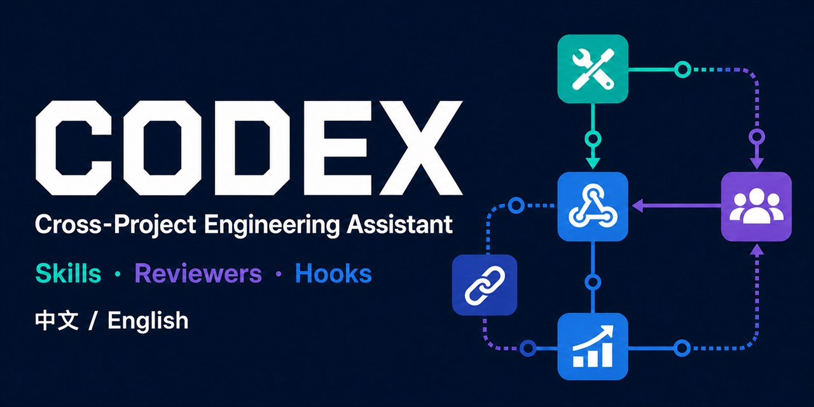

<p align="right">
  <strong>简体中文</strong> · <a href="README.en.md">English</a>
</p>

# Codex 跨项目长期技术助手

<p align="center">
  
</p>

<p align="center">
  面向 Codex 的跨项目工程协作框架：Skill 路由、多 Agent 独立复审、可恢复任务记忆、生命周期事件与受控演进。
</p>

<p align="center">
  <a href="https://github.com/JimmyVGDY/codex-long-term-assistant-skills/actions/workflows/ci.yml"></a>
  <a href="https://jimmyvgdy.github.io/codex-long-term-assistant-skills/"></a>
  <a href="https://github.com/JimmyVGDY/codex-long-term-assistant-skills/releases/latest"></a>
  <a href="LICENSE"></a>
  
  
</p>

V7.0.0 将主领域重构为通用后端、通用前端、通用 AI 和数据中间件基础设施，面向 Windows 原生 Codex CLI 0.150.1 提供中文、英文两个可独立安装且可复现构建的 Plugin 发行包。主 Agent 的模型配置保持不变，自动子 Agent 的最高策略边界为 Terra High。

**快速入口：** [双语文档站](https://jimmyvgdy.github.io/codex-long-term-assistant-skills/) · [下载](#下载) · [使用示例](#可复现使用示例) · [兼容矩阵](#兼容矩阵) · [安装](#五分钟升级) · [文档](#文档与协作)

## 下载

| 发行包 | 适用界面 | 下载 |
| --- | --- | --- |
| `Codex-Skills-V7.0.0-zh-CN.zip` | 简体中文 | [下载中文安装包](https://github.com/JimmyVGDY/codex-long-term-assistant-skills/releases/download/v7.0.0/Codex-Skills-V7.0.0-zh-CN.zip) |
| `Codex-Skills-V7.0.0-en.zip` | English | [Download English package](https://github.com/JimmyVGDY/codex-long-term-assistant-skills/releases/download/v7.0.0/Codex-Skills-V7.0.0-en.zip) |

[查看最新 Release、校验和与构建见证](https://github.com/JimmyVGDY/codex-long-term-assistant-skills/releases/latest)

## 核心能力

- 10 个工程 Skill，按当前任务最小充分路由并渐进加载。
- 4 个稳定主领域：通用后端、通用前端、通用 AI、数据中间件基础设施；语言和框架作为按需 Reference。
- 7 个逻辑只读 Reviewer，定义文件不写死模型或推理强度。
- 6 个生命周期 Hook：`UserPromptSubmit`、`PreToolUse`、`SubagentStart`、`SubagentStop`、`Stop`、`SessionEnd`。
- TaskOutcomeEvent 2.0、`project_id + repo_fingerprint` 双重隔离与连续哈希链。
- 可恢复检查点、延迟 SessionEnd 封印、事件归档与跨项目健康概览。
- `execution_authorization=NONE` 的受控优化提案，不授予实施权限。


## 可复现使用示例

以下内容展示一次典型只读任务的输入、流程和可检查结果；它是使用示例，不是当前会话的运行证明。

**任务输入**

```text
检查当前仓库的安装器升级路径，只读分析，不修改文件；
按风险选择 Reviewer，并区分已确认事实、推断和未验证项。
```

**预期流程**

```text
任务输入
  -> 路由 engineering-quality-delivery
  -> 读取安装器、清单、测试与升级文档
  -> 按实际风险启动逻辑只读 Reviewer
  -> 汇总并去重 Reviewer 发现
  -> 输出证据、风险和未验证边界
```

生命周期可形成 `TURN_OPENED -> SUBAGENT_STARTED -> SUBAGENT_STOPPED -> TASK_COMPLETED` 事件序列；会话结束后由 `SessionEnd` 进入延迟封印流程。模型证据应保持三个独立字段：

```ini
requested_model_policy = PASS
runtime_model_evidence = UNAVAILABLE
diagnostic_model_observation = host diagnostic only
```

其中 `requested_model_policy=PASS` 只证明自动流程未主动请求超过 Terra High 的配置，不证明实际运行模型。

## 兼容矩阵

| 环境或模式 | 当前定位 | 已有验证层级 | 边界 |
| --- | --- | --- | --- |
| Windows 原生 Codex CLI 0.150.1 + Plugin | 主要目标 | V7.0.0 源码树完成 `6.6.0 -> 7.0.0` Plugin 升级、三段 payload 同源读回与新任务隐式路由观察 | 公开 ZIP 仍应在目标账户独立安装和读回 |
| Windows `windows-latest` + Python 3.13 | CI | 双语审计、完整包验证与发行构建 | CI 不替代真实 Codex 账户验收 |
| Ubuntu `ubuntu-latest` + Python 3.13 | CI 包级兼容 | 双语审计与完整包验证 | 不代表 Plugin、Marketplace 或 Hook 的 Linux 宿主验收 |
| standalone 模式 | 兼容模式 | 安装结构与回归测试覆盖 | 不是 V7.0.0 的主要发行验收路径 |
| macOS | 未验证 | 无当前 CI 或宿主验收证据 | 状态保持 `UNVERIFIED` |

Python 源码声明支持 3.8+；当前公开 CI 固定使用 3.13。与目标环境不同的组合应先执行 `doctor`、`dry-run` 和 `verify`，再判断可用状态。

## 五分钟升级

1. 下载对应语言的 ZIP，并解压到临时目录。
2. 在解压后的包根目录依次执行：

```powershell
python scripts\package_manager.py doctor
python scripts\package_manager.py install --scope user --mode plugin --dry-run
python scripts\package_manager.py install --scope user --mode plugin
python scripts\package_manager.py verify --scope user --mode plugin
codex plugin list --json
```

3. 仅当 Plugin 读回 `installed=true`、`enabled=true`、`version=7.0.0`，且旧领域 Skill 不再发现时，升级状态才成立。

安装器会识别已有版本、备份并移除受管旧 Skill、拒绝链接与 Reparse Point 风险，并保留未知文件。完整流程见 [安装与恢复](docs/INSTALLATION_RECOVERY.md) 和 [V7.0 使用指南](docs/USER_GUIDE_V7.0.md)。

## 模型证据边界

```ini
requested_model_policy = PASS
runtime_model_evidence = UNAVAILABLE
diagnostic_model_observation = 仅诊断旁证
```

Codex 0.150.1 尚未向 Hook 提供可信且可关联的实际模型证明。请求 Luna 或 Terra 配置，不等于实际运行模型已验证。自动成本阶梯为：

```text
luna-low -> luna-medium -> terra-medium -> terra-high
```

自动流程拒绝 Sol、`xhigh`、`max`、`ultra` 及任何超过 `gpt-5.6-terra + high` 的配置。

## 文档与协作

- [文档中心](docs/README.md)：安装、配置、架构、模型策略、验证与历史资料。
- [贡献指南](.github/CONTRIBUTING.md)：分支、提交、双语覆盖与验证方式。
- [安全策略](.github/SECURITY.md)：漏洞报告边界与敏感信息处理。
- [行为准则](.github/CODE_OF_CONDUCT.md)：公共协作的基本边界。
- [版本记录](CHANGELOG.md) · [V7.0.0 发行说明](docs/releases/v7.0.0/RELEASE_NOTES.md)

## 本地验证

```powershell
python scripts\localization-audit.py --strict
python scripts\validate-package.py
```

发行构建采用固定时间戳、稳定排序和 SHA-256 见证。源码仓库与发行安装包是不同证据层：仓库 CI 证明当前提交，Release 附件及其见证证明可下载产物。

## 发行来源证明

`Release Candidate and Provenance` 工作流会校验版本标签、在 Windows 与 Ubuntu 上验证源码、构建两个可复现 ZIP，并通过 GitHub Artifact Attestations 为实际 ZIP 摘要生成签名来源证明。标签流程只创建草稿，不会自动公开发布或覆盖既有 Release。

```shell
gh attestation verify Codex-Skills-V7.0.0-zh-CN.zip --repo OWNER/REPOSITORY
```

完整门禁和新版本发布步骤见 [Release 自动化与制品来源证明](docs/releases/RELEASE_AUTOMATION.md)。

## 安全边界

- 不自动修改 Skill、Reviewer、模型路由、全局配置或业务仓库。
- 不自动接受或执行优化提案。
- 不自动提交、推送、部署、重启、操作生产环境或写入业务数据。
- Evidence 只记录事实，不授予权限。
- 默认不保存原始 Prompt、完整回答、代码正文、Diff、Token、Cookie、API Key 或凭据。

Apache-2.0 许可，见 [LICENSE](LICENSE)。
