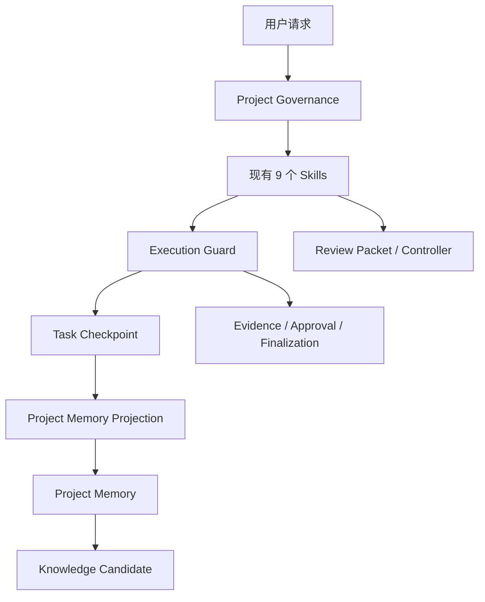

# V5.0 项目治理与证据闭环设计

## 1. 架构定位

V5.0 不建立 AICTO 式完整组织治理层，而是在 V4.2 工程执行平面外增加三个轻量平面：



- Governance 决定项目身份、范围和约束，不执行生产动作；
- Skills、Execution Guard 和 Review Controller 负责工程执行；
- Evidence 证明观察结果，不授予权限；
- Approval 约束动作，不证明动作成功；
- Finalization 从真实状态读回，防止交付措辞超过证据；
- Checkpoint、Project Memory、Knowledge 分属不同事实层。

## 2. 六维路由

V5.0 明确分离：

| 维度 | 作用 |
|---|---|
| Complexity `L0-L4` | 决定问题范围、上下文规模和推理复杂度 |
| Project Stage | 表示项目处于未接管、接管、活跃、暂停或归档 |
| Execution Profile | 决定授权、验证、回滚和交付门禁 |
| Reviewer Budget | 决定 Reviewer 数量、轮次和成本 |
| Model Profile | 决定子 Agent 模型和推理强度 |
| Host Surface | 决定主会话、Subagent、Worktree、MCP 或长期任务 |

禁止将它们机械映射。例如一行生产配置可能是 `L1 + STRICT + terra-high`，而大型只读架构分析可能是 `L3 + STANDARD + terra-medium`。

## 3. Project Profile 与 Project State

### 3.1 Project Profile

保存变化较慢的事实：

- Project ID、仓库路径和 Remote；
- 语言、框架、构建工具和模块标记；
- 构建、测试、启动入口及其可信度；
- 环境、数据边界和禁止路径；
- 已确认事实、未知项和最后验证时间。

Profile 使用完整性哈希和稳定 `binding_sha256`。更新时间等易变字段不会无意义地使所有任务绑定失效；真正改变项目身份或边界时，旧任务必须重新绑定。

### 3.2 Project State

保存变化较快的状态：

- 项目阶段；
- 当前 Git 基线；
- 当前任务；
- 风险、阻塞、唯一下一步；
- 最后 Checkpoint。

Profile 与 State 的 Project ID 不一致时失败关闭。

## 4. Task Envelope V2

Task Envelope V2 形成以下绑定链：

```text
Project Profile
  → Project State
  → Task ID
  → Git Baseline
  → Routing
  → Gates
  → Approval
  → Evidence
  → Actions
  → Finalization
```

`execution_guard.py` 保留 V4.2 原命令，并新增：

- `--project-profile`、`--project-state`、`--project-id`；
- `--complexity`、`--project-stage`、`--reviewer-budget`；
- `--model-profile`、`--host-surface`、`--environment`；
- `authorize-action`；
- `record-action`；
- `finalize`。

## 5. 事实源边界

| 对象 | 权威 Owner |
|---|---|
| Skill/Reviewer/版本 | `manifest.json` |
| 项目身份 | `project-profile.json` |
| 项目当前状态 | `project-state.json` |
| 任务阶段、门禁和动作 | `execution-state.json` |
| Review 调度 | `review-state.json` |
| Review 输入基线 | Review Packet Manifest |
| 任务恢复 | `CURRENT_TASK.md` + `PROGRESS.md` |
| 项目长期事实 | 审核后的 `project-memory.md` |
| 跨项目经验 | Knowledge Candidate Registry |

其他 Markdown 只作为解释、模板或投影，不能覆盖机器状态。

## 6. 失败关闭场景

以下情况必须阻断或降级为 `NOT_CAPTURED`：

- Profile 与实际仓库不一致；
- Project ID 或 Task ID 不一致；
- Profile 的绑定哈希变化；
- Approval 过期、已消费、跨环境或基线变化；
- Evidence 绑定的仓库指纹变化；
- Finalization 声明超过实际读回证据；
- Checkpoint 未经审核直接写入 Project Memory；
- 单项目经验试图自动成为 Active Knowledge。

## 7. 非目标

- 不提供操作系统或云平台权限隔离；
- 不自动调用模型、MCP、Git Push、部署或重启；
- 不自动把项目推断写成确认事实；
- 不建立 Portfolio、Investment 或完整 Capability 生命周期；
- 不把所有项目规则一次性加载到上下文；
- 不使用检查器通过代替用户验收和生产 Gate。
