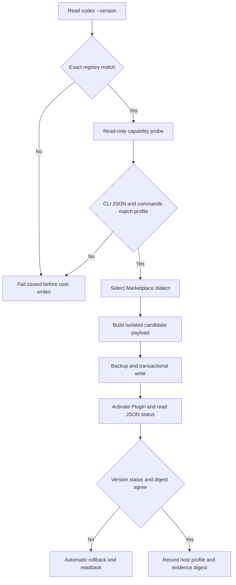

# V7.4.1 Codex Ten-Version Compatibility Design

## Document information

- Project: `codex-long-term-assistant-skills`
- Target release: V7.4.1
- Design baseline: V7.4.0 / Git `9122d36`
- Host anchor: Codex CLI 0.153.0
- Date: 2026-09-03
- Status: core implementation and the isolated Windows matrix pass; Ubuntu CI, real-host, and release gates remain

## Executive summary

V7.4.1 expands the single-host allowlist in V7.4.0 into an immutable compatibility window: Codex CLI 0.153.0 plus the ten preceding stable releases in publication order, for eleven versions in total. Patch releases count separately. Alpha, beta, RC, future, and otherwise unlisted versions are outside the window.

The design combines a frozen version registry, read-only host capability probes, Marketplace contract profiles, and layered validation evidence. The installer must not admit a host solely because it falls inside a numeric version range, and it must not expand the window dynamically from an online latest-version query. Every listed version must complete isolated installation, Plugin activation, and readback with the actual CLI. Only the anchor version requires full acceptance in the real user account. Hook input may tolerate absent observational fields, but a security gate with missing required fields remains fail-closed. Observability and attribution limitations must never be reported as verified capabilities.

This release changes host compatibility only. It does not modify V7.4.0 root-task budgeting for Reviewer, Explorer, and Worker roles, model weights, automatic model ceiling, parent-finalized calibration, Proposal authorization, or privacy boundaries.

## 1. Terminology and compatibility window

The requested “forward compatibility with ten versions” is defined here as “V7.4.1 host compatibility with the ten preceding stable Codex releases.” To avoid confusion with forward compatibility in its usual sense of accepting future versions, code and validation reports use `backward_host_compatibility_window`.

### 1.1 Frozen window

| Order | Codex CLI | Window identity |
|---:|---|---|
| 0 | 0.153.0 | Current anchor |
| 1 | 0.152.1 | First preceding stable release |
| 2 | 0.152.0 | Second preceding stable release |
| 3 | 0.151.0 | Third preceding stable release |
| 4 | 0.150.1 | Fourth preceding stable release |
| 5 | 0.150.0 | Fifth preceding stable release |
| 6 | 0.149.1 | Sixth preceding stable release |
| 7 | 0.149.0 | Seventh preceding stable release |
| 8 | 0.148.0 | Eighth preceding stable release |
| 9 | 0.147.0 | Ninth preceding stable release |
| 10 | 0.146.1 | Tenth preceding stable release |

The order follows the stable-release records in the official OpenAI Codex changelog as of 2026-09-03. Version 0.146.0 is the first version outside the window. If a new stable Codex release appears before the V7.4.1 release candidate freezes, moving the anchor requires an explicit decision. Moving it invalidates and reruns the complete eleven-version matrix, documentation, and release evidence.

### 1.2 Meaning of support

A version is supported only when all of the following are true:

1. It matches an exact V7.4.1 registry entry.
2. Plugin subcommands and JSON readback pass capability probes.
3. Its Marketplace manifest dialect passes validation.
4. Installation, activation, verification, uninstall, and recovery succeed in an isolated `CODEX_HOME`.
5. Hook contract regressions for the version pass.
6. The release report does not extrapolate package tests, synthetic Hook tests, or anchor-version host evidence to another version.

If any condition fails, the version cannot be published as compatible. A successful standalone fallback cannot substitute for a failed Plugin path while retaining a full compatibility claim.

## 2. Current state and evidence

| Conclusion | Evidence | Level |
|---|---|---|
| V7.4.0 admits Codex CLI 0.153.0 only | `SUPPORTED_CODEX_VERSIONS` in `scripts/package_manager.py` contains one version; the README and V7.4.0 release report defer the ten-version window | Confirmed |
| Codex 0.153.0 is available on this host and exposes Plugin add/list/marketplace/remove | Read-only local `codex --version` and `codex plugin --help` probes | Confirmed |
| Codex 0.153.0 adds remote Marketplace CLI support | Official OpenAI 0.153.0 changelog | Confirmed |
| All eleven official packages in the frozen window expose complete Plugin management | Every package completed version, `plugin list --json`, and four management-command probes in an isolated `CODEX_HOME` | Confirmed |
| All eleven versions accept one local Marketplace manifest with `interface.displayName` and without `owner` | Every version completed Marketplace add, Plugin add, Plugin JSON readback, Plugin remove, and Marketplace remove without real-account credentials | Confirmed |
| All eleven `plugin list --json` target objects share the same structure | Every result contains `pluginId/name/marketplaceName/version/installed/enabled/source/marketplaceSource/installPolicy/authPolicy` | Confirmed |
| Current official Hook documentation defines fields including `model`, `permission_mode`, `tool_use_id`, `agent_id`, and `agent_type`, while still accepting legacy `decision=block` output | Official OpenAI Hooks documentation | Confirmed for current documentation only |
| Every historical version emits the same Hook fields | Full real lifecycle sampling has not been completed for all eleven versions | Not verified |
| The ordinary Hook `model` field is trusted model or cost evidence | V7.4.0 requires an external trust anchor; V7.4.1 does not change that decision | False |

Official references:

- [Codex changelog](https://learn.chatgpt.com/docs/changelog?type=codex-cli)
- [Hooks](https://learn.chatgpt.com/docs/hooks)
- [Build plugins](https://learn.chatgpt.com/docs/build-plugins)
- [Build skills](https://learn.chatgpt.com/docs/build-skills)

## 3. Goals and non-goals

### 3.1 Goals

1. Allow one V7.4.1 package to install, activate, verify, and recover safely on the frozen eleven-version window.
2. Separate version matching, capability verification, and compatibility claims. A matching version is not automatic proof of capability.
3. Add small, explicit, testable adapters for Marketplace manifests, Plugin JSON, and Hook differences.
4. Preserve offline reproducibility. Formal validation uses versioned and digest-bound official CLI inputs rather than a runtime query for the latest version.
5. Report the target host, adapter profile, verified evidence layer, and degraded capabilities accurately in doctor, dry-run, status, and release outputs.
6. Detect host drift after a user upgrades or downgrades Codex, then require a reinstall instead of silently retaining an incompatible Marketplace dialect.

### 3.2 Non-goals

- Support for 0.146.0 or earlier versions.
- Support for alpha, beta, RC, or unknown future versions.
- Automatic admission of 0.154.0 or later through a loose SemVer range.
- Changes to DelegationBudget V1, TaskOutcomeEvent V2, or the Evolution data contracts.
- Treating the ordinary Hook `model` field as trusted runtime-model evidence merely because current documentation exposes it.
- Copying, migrating, or reusing user authentication credentials to run historical host sessions.
- Runtime code changes, user Plugin installation, commits, pushes, or releases during this design phase.

## 4. Candidate approaches

### 4.1 Approach A: Numeric version range

Implement `0.146.1 <= version <= 0.153.0`.

This is small, but it can admit unverified patch versions and cannot represent Marketplace dialect or JSON-contract differences. It also makes the release claim vulnerable to future version changes. Rejected.

### 4.2 Approach B: Frozen registry and capability profiles

Use a versioned JSON registry that enumerates all eleven versions and binds each to Marketplace, CLI, Hook, and validation profiles. Match the registry first, run read-only capability probes second, and let adapters generate or parse only verified profiles.

This is deterministic, reproducible offline, auditable, and fail-closed, while expressing degraded capabilities precisely. Its cost is maintaining the matrix and cached inputs. Recommended.

### 4.3 Approach C: Online runtime discovery

Read the online latest version and release history during installation, then calculate the ten-version window dynamically.

This updates automatically, but the behavior of the same V7.4.1 package changes over time, offline installation fails, supply-chain evidence is difficult to freeze, and new hosts can be admitted before testing. Rejected.

## 5. Recommended architecture



### 5.1 Authoritative compatibility registry

Add `config/codex-compatibility-v1.json` as the sole machine-authoritative source. `manifest.json`, README files, doctor, CI, and release reports must reference or generate their values from it instead of maintaining separate lists.

Proposed structure:

```json
{
  "schema_version": 1,
  "package_version": "7.4.1",
  "window_policy": {
    "anchor": "0.153.0",
    "preceding_stable_releases": 10,
    "include_patch_releases": true,
    "include_prereleases": false,
    "frozen_at": "2026-09-03"
  },
  "versions": [
    {
      "version": "0.153.0",
      "marketplace_profile": "local-interface-v2",
      "plugin_cli_profile": "remote-capable-v2",
      "hook_profile": "hook-json-v1"
    },
    {
      "version": "0.152.1",
      "marketplace_profile": "local-interface-v2",
      "plugin_cli_profile": "plugin-list-v1",
      "hook_profile": "hook-json-v1"
    }
  ]
}
```

The machine file must enumerate all eleven versions with no example-only or default entries. It also defines closed Marketplace, Plugin CLI, Plugin JSON, and Hook profiles. A version may reference only declared profiles; unknown, unused, duplicate, or missing profiles fail closed. Each entry binds the official tarball URL, npm SRI, tarball SHA-256, help-probe digest, and isolated Plugin evidence state. The canonical registry SHA-256 is stored in install state. Any registry change invalidates the full compatibility matrix.

### 5.2 Strict version parsing

Add one centralized parser that accepts a verified stable three-component version from `codex-cli X.Y.Z`. Prerelease suffixes, unknown extra versions, ambiguous output, and empty output are rejected. String containment and numeric ranges cannot decide compatibility.

Output includes at least:

- `detected_codex_version`
- `compatibility_registry_match`
- `compatibility_profile`
- `version_evidence_source=codex--version`
- `version_evidence_digest`

### 5.3 Marketplace dialect adapters

Change `_merged_marketplace_manifest(existing)` to take `marketplace_profile` explicitly. Per-version isolated evidence shows that all eleven versions use `local-interface-v2`: emit managed `interface.displayName` and omit `owner`. `local-legacy-v1` remains migration input for old install state and is not emitted by V7.4.1.

Field ownership is minimal: the package manages top-level `name`, `interface.displayName`, and its own Plugin entry. Other top-level fields, unrelated nested `interface` keys, and other Plugin entries are preserved. A legacy managed `owner` is removed only when known old state proves package ownership; otherwise it is preserved and reported.

Each dialect must pass target-CLI parsing and `plugin list --json` in an isolated directory before any user Marketplace write. The installer cannot write the real Marketplace first and use that failure to discover the dialect.

### 5.4 Plugin CLI and JSON normalization

Retain the `marketplace add -> plugin add -> plugin list --json` flow. All eleven versions use one closed `plugin-list-v1` input contract; no unobserved historical aliases are registered for this window. The normalized object is:

```text
plugin_id
name
marketplace_name
version
installed
enabled
install_policy
auth_policy
```

Only top-level `installed/available` is accepted. The target item must be an object with unique identity; `pluginId` must equal `name@marketplaceName`, and all three values must agree when present. `version` must be a stable three-part version, `installed/enabled` accept only JSON `true`, and policy fields accept only registry enums. Unknown top-level structures, alias conflicts, non-JSON output, duplicate targets, and Marketplace mismatches fail closed.

The remote-Marketplace capability introduced in 0.153.0 is not a dependency of V7.4.1 local installation. The package continues to use a local Marketplace so historical versions remain viable.

### 5.5 Hook compatibility policy

Hooks use two tracks: strict security gates and tolerant observational fields.

- Tool name, tool input, and stable call ID are required for the PreToolUse budget gate. Missing values fail closed.
- Missing non-critical fields in UserPromptSubmit, SubagentStart/Stop, Stop, or SessionEnd become `UNAVAILABLE` rather than guessed values.
- Input normalization continues to accept registered snake_case, camelCase, and legacy aliases, each backed by version-specific contract tests.
- Denials prefer one common format verified across all eleven versions. Current official documentation still accepts legacy `decision=block`; if every version passes it, use that single shape and avoid runtime host-version branching.
- If no common secure denial shape exists, V7.4.1 release stops. Historical hosts cannot degrade to fail-open behavior.
- Stop and SubagentStop always emit valid JSON. Observability failure cannot become a host protocol failure.

`hook-json-v1` registers snake_case and camelCase aliases explicitly. Conflicting aliases for one semantic value fail PreToolUse closed and become `UNAVAILABLE` for observational Hooks. PreToolUse denial keeps the V7.4.0 `hookSpecificOutput.hookEventName/permissionDecision/permissionDecisionReason` envelope. All eleven versions receive credential-free synthetic replay and JSON-schema validation; historical real sessions remain `REAL_HOST_NOT_EVALUATED`. If later real-host evidence shows that any version ignores this denial envelope, its compatibility claim is withdrawn and release stops.

The ordinary Hook `model` value remains an unauthenticated host declaration. Unless V7.4.0 external trust-anchor requirements are also met, `runtime_model_evidence` remains `UNAVAILABLE`.

### 5.6 Lifecycle-association degradation

V7.4.0 already establishes that when a host does not propagate a reservation ID from PreToolUse to SubagentStart/Stop, temporal proximity cannot be used to guess correlation. V7.4.1 preserves that rule:

- PreToolUse atomically reserves budget.
- Explicitly correlated lifecycle events may advance to STARTED/COMPLETED.
- Uncorrelated events leave the reservation in RESERVED and set `association_complete=false`.
- Compatibility reports separate pre-dispatch budgeting from exact lifecycle attribution.

### 5.7 Host drift

Install state moves to schema 3 and gains a compatibility snapshot containing Codex version, canonical executable path and SHA-256, registry schema and canonical digest, capability profiles, Marketplace profile, normalized probe digest, and payload digest. Schema 1/2 without a snapshot reads as `LEGACY_HOST_PROFILE_UNKNOWN` and cannot claim host compatibility. The complete snapshot is persisted only after activation, JSON readback, and cache verification succeed. Unknown or damaged snapshots fail closed while preserving the original file.

Doctor, verify, and status compare the complete host binding rather than version alone. A version, executable digest, registry digest, profile, or normalized capability digest change returns `HOST_DRIFT_REINSTALL_REQUIRED`. Installation probes again before activation; if the host changes during the transaction, files are restored, and failure to reactivate the old Plugin under the changed host becomes `RECOVERY_REQUIRED` rather than a successful rollback claim.

Reinstallation continues to use transactional backup and recovery. It must not silently rewrite the Marketplace manifest in place. Unknown versions may use an explicitly selected standalone mode, but cannot be reported as Plugin-compatible.

## 6. Validation and evidence layers

### 6.1 Evidence levels

| Level | Meaning | Allowed claim |
|---|---|---|
| `PACKAGE_PASS` | Python, static-contract, and release-package checks | Package structure only; no Codex host claim |
| `CLI_CONTRACT_PASS` | Target official CLI passes command, manifest, and JSON tests in isolation | Plugin management contract for that version |
| `ISOLATED_PLUGIN_PASS` | Isolated `CODEX_HOME` passes install, activation, verify, uninstall, and recovery | Base Plugin compatibility for that version |
| `SYNTHETIC_HOOK_PASS` | Version fixture passes Hook input/output regressions | Hook contract compatibility, not a real conversation |
| `REAL_HOST_PASS` | A new real-account task triggers and reads back Plugin, Skill, and Hook behavior | Only the tested version and environment |

Every listed version needs at least `ISOLATED_PLUGIN_PASS + SYNTHETIC_HOOK_PASS`. Codex 0.153.0 additionally requires native Windows `REAL_HOST_PASS`. Historical versions without real-account tasks remain `REAL_HOST_NOT_EVALUATED`.

### 6.2 CI topology

Do not create an unnecessary 44-cell cross-product between Python and Codex versions:

1. Retain the Windows/Ubuntu by Python 3.11/3.13 package matrix.
2. Add a Windows/Ubuntu by eleven Codex versions compatibility matrix with one supported Python version per platform.
3. Run expanded dialect and recovery-boundary tests for 0.153.0, 0.152.1, 0.151.0, 0.149.0, and 0.146.1.
4. Cache official CLI packages by platform, Codex version, and lockfile digest.
5. Record official package version, source, and SHA-256. Offline replay cannot substitute a different package automatically.

### 6.3 Required scenarios

- All eleven exact versions match; 0.146.0, 0.154.0, prereleases, and malformed versions are rejected.
- Patch releases count separately and registry ordering remains exact.
- All eleven versions independently validate and use `local-interface-v2`; `local-legacy-v1` is migration input only.
- Unknown existing Marketplace fields remain; managed `owner/interface` fields are emitted or removed precisely by dialect.
- Registered historical `plugin list --json` shapes normalize to one internal object.
- Capability-probe failure before install creates no lock, journal, backup, or user target.
- A Codex version change after installation makes verify fail with reinstall guidance.
- Failures after Plugin add, cache verification, state writing, and dialect switching restore the previous installation.
- All six Hooks return valid JSON for each version fixture; a PreToolUse denial cannot fail open.
- Missing or aliased `model`, `permission_mode`, `turn_id`, `tool_use_id`, and `agent_id` have explicit outcomes.
- A reservation without lifecycle correlation stays RESERVED without duplicate charge or guessed completion.
- Windows paths with spaces, Chinese characters, long paths, and nested `commandWindows` quoting pass.
- Source, Marketplace, cache, and install-state payload identities remain separately readable.
- V7.4.0 to V7.4.1 upgrade, V7.4.1 reinstall, uninstall, and recovery preserve unknown user assets.

## 7. Implementation batches and commit boundaries

1. `feat | 新增 Codex 十版本兼容注册表与严格版本解析`
   - Add only the machine registry, parser, and contract tests.
   - Do not change installer behavior.

2. `feat | 实现 Marketplace 方言与 Plugin JSON 兼容层`
   - Add dialect selection, isolated capability probing, and JSON normalization.
   - Do not change Hook policy.

3. `feat | 接入宿主漂移检测与 Hook 兼容门禁`
   - Persist capability snapshots and detect host drift in verify, doctor, and status.
   - Establish the common Hook denial shape and field-alias contracts.

4. `test | 增加十一版 Codex 跨平台兼容矩阵`
   - Add pinned official CLI inputs, caching, isolated installation, recovery, and evidence aggregation.
   - Emit per-version and per-evidence-layer reports.

5. `docs | 发布 V7.4.1 双语兼容说明与验证证据`
   - Update versions, bilingual README files, CHANGELOG, user guide, installation recovery guide, and release material together at the end.
   - Start only after the first four batches are stable and current-account installation succeeds.

Each batch is independently reversible and includes focused tests. Approval of this design is not implementation, commit, push, or release authorization.

## 8. Release gates

The V7.4.1 candidate requires all of the following:

1. The registry contains exactly eleven unique stable versions, with an officially sourced anchor and ordering.
2. All 22 Windows/Ubuntu compatibility cells pass.
3. The existing Python 3.11/3.13 package matrix passes.
4. Five breakpoint versions pass expanded dialect, crash-recovery, and Hook contract tests.
5. Native Windows Codex 0.153.0 passes user-level forced reinstall, verify, status, doctor, and `plugin list --json`.
6. A new task passes real Plugin, Skill, and Hook discovery.
7. Independent compatibility, data-contract, and delivery reviews have no open blocker.
8. Chinese and English documents, version, artifacts, digests, tag, CI, and Release status are read back separately.

Release stops if any historical version cannot deny tool use safely, cannot activate the Plugin, requires copying real credentials for validation, or requires weakening a V7.4.0 security policy.

## 9. Risks and controls

| Risk | Impact | Control | Stop condition |
|---|---|---|---|
| Numeric range substitutes for capability evidence | Unverified hosts are admitted | Exact registry plus read-only probes | An unregistered shape is accepted |
| Wrong Marketplace dialect | Plugin list or upgrade chain breaks | Isolated parsing before user writes; transaction rollback | Isolated and user results disagree |
| Historical Hook output fails open | Security gate is lost | Verify one common denial shape per version | Any version cannot block reliably |
| Eleven-version matrix is slow or unstable | CI cost and latency rise | CLI package cache; separate Python and Codex dimensions | Package source and digest cannot be frozen |
| Synthetic test is reported as real-host evidence | Compatibility is overstated | Five explicit evidence levels | Reports cannot distinguish layers |
| Codex upgrade or downgrade retains old dialect | Installed Plugin fails | Detect host drift and require reinstall | Verify still passes drifted state |
| Historical support weakens V7.4.0 policy | Permission, budget, or privacy regression | Non-regression tests and independent review | Fail-open or sensitive-body retention is required |

## 10. Open decisions and unverified items

1. This design counts stable releases, so patch versions 0.152.1, 0.150.1, 0.149.1, and 0.146.1 are included. Counting ten minor versions instead would produce a different window and requires redesign.
2. Official packages, CLI help, empty Plugin JSON, Marketplace input, full install/remove readback, and synthetic Hooks passed locally on Windows for all eleven versions under registry digest `1c204bd34cc355d5771376278c6251a5e133b7db09a7613b5c35d5c7bcdcbdd8`. GitHub CI must still replay the Windows and Ubuntu matrix.
3. Evidence corrected the early assumption: `local-interface-v2` passes on all eleven versions; the legacy profile remains only for migration and recovery testing.
4. Real historical Hook payloads have not been captured. This release claims only `SYNTHETIC_HOOK_PASS` for those versions and may use credential-free isolated samples plus current-version real-account evidence, but it must not copy user authentication files.
5. If Codex publishes another stable version before candidate freeze, the requester must choose between retaining the 0.153.0 anchor and moving the window with a full evidence rerun.
