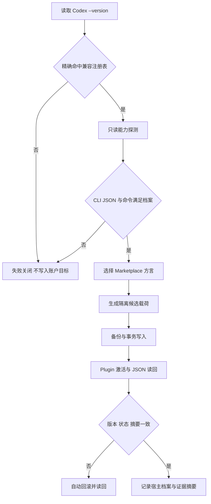

# V7.4.1 Codex 十版本兼容设计

## 文档信息

- 所属项目：`codex-long-term-assistant-skills`
- 适用版本：V7.4.1
- 设计基线：V7.4.0 / Git `9122d36`
- 宿主锚点：Codex CLI 0.153.0
- 日期：2026-09-03
- 状态：核心实现与 Windows 隔离矩阵通过；Ubuntu CI、实机与发布门禁待完成

## 执行摘要

V7.4.1 将 V7.4.0 的单一宿主白名单扩展为一个不可动态漂移的兼容窗口：Codex CLI 0.153.0 加按正式发布时间倒序排列的前 10 个稳定发行版，共 11 个版本。补丁版本独立计数，alpha、beta、RC 和未列入本版注册表的未来版本不在范围内。

采用“固定版本注册表 + 宿主能力探测 + Marketplace 契约档案 + 分层验证证据”。安装器不能用简单的版本大小比较直接放行，也不能在联网时自动扩大范围。每个受支持版本必须通过真实 CLI 的隔离安装、Plugin 激活与读回；只有当前锚点需要在真实账户上完成完整验收。Hook 输入允许兼容字段缺失，但安全门禁缺少必要字段时继续失败关闭；观察和归因能力不能被伪装为已验证。

本版只做宿主兼容，不修改 V7.4.0 的 Reviewer、Explorer、Worker 根任务预算、模型权重、自动模型上限、父级校准、Proposal 授权或隐私边界。

## 一、术语与兼容窗口

本文把“向前兼容十个版本”定义为“V7.4.1 对此前十个 Codex 稳定发行版保持宿主兼容”。为避免与通常表示未来版本可用性的“前向兼容”混淆，代码和验证报告统一使用 `backward_host_compatibility_window`。

### 1.1 固定窗口

| 顺序 | Codex CLI | 窗口身份 |
|---:|---|---|
| 0 | 0.153.0 | 当前锚点 |
| 1 | 0.152.1 | 前第 1 个稳定版 |
| 2 | 0.152.0 | 前第 2 个稳定版 |
| 3 | 0.151.0 | 前第 3 个稳定版 |
| 4 | 0.150.1 | 前第 4 个稳定版 |
| 5 | 0.150.0 | 前第 5 个稳定版 |
| 6 | 0.149.1 | 前第 6 个稳定版 |
| 7 | 0.149.0 | 前第 7 个稳定版 |
| 8 | 0.148.0 | 前第 8 个稳定版 |
| 9 | 0.147.0 | 前第 9 个稳定版 |
| 10 | 0.146.1 | 前第 10 个稳定版 |

版本顺序依据 OpenAI 官方 Codex 更新日志在 2026-09-03 的稳定发行记录。0.146.0 是窗口外第一个版本。若 V7.4.1 候选版冻结前出现新的稳定 Codex 版本，必须人工决定是否移动锚点；一旦移动，完整 11 版本矩阵、文档和发行证据全部失效并重跑。

### 1.2 支持声明

“受支持”必须同时满足：

1. 版本精确命中 V7.4.1 注册表；
2. Plugin 子命令和 JSON 读回能力探测通过；
3. 对应 Marketplace 清单方言验证通过；
4. 在隔离的 `CODEX_HOME` 完成安装、激活、校验和卸载恢复；
5. 该版本对应的 Hook 契约回归通过；
6. 发行报告没有把包级测试、合成 Hook 测试或当前版实机结果外推到其他版本。

不满足任一条件时，该版本不得以“兼容”发布。不能用 standalone 模式成功替代 Plugin 模式失败后继续宣称完整兼容。

## 二、现状与证据

| 结论 | 证据 | 等级 |
|---|---|---|
| V7.4.0 只放行 Codex CLI 0.153.0 | `scripts/package_manager.py` 中 `SUPPORTED_CODEX_VERSIONS` 只有一个版本；README 和 V7.4.0 发行报告也明确延后十版本窗口 | 已确认 |
| 0.153.0 本机可用，Plugin CLI 包含 add/list/marketplace/remove | 本机 `codex --version` 与 `codex plugin --help` 只读探测 | 已确认 |
| 0.153.0 新增远程 Marketplace CLI 能力 | OpenAI 官方 0.153.0 更新日志 | 已确认 |
| 固定窗口的 11 个官方包均存在完整 Plugin 管理入口 | 11 个官方 npm 制品在隔离 `CODEX_HOME` 中完成版本、`plugin list --json` 与四个管理子命令探测 | 已确认 |
| 11 个版本均接受同一个含 `interface.displayName`、不含 `owner` 的本地 Marketplace 清单 | 每版分别完成 Marketplace add、Plugin add、Plugin JSON 读回、Plugin remove 与 Marketplace remove；无真实账户凭据 | 已确认 |
| 11 个版本的 `plugin list --json` 目标对象结构一致 | 均返回 `pluginId/name/marketplaceName/version/installed/enabled/source/marketplaceSource/installPolicy/authPolicy` | 已确认 |
| 当前官方 Hook 文档提供 `model`、`permission_mode`、`tool_use_id`、`agent_id`、`agent_type` 等字段，并仍接受旧式 `decision=block` 输出 | OpenAI 官方 Hooks 文档 | 已确认，仅代表当前文档 |
| 旧版 Hook 是否逐版提供完全相同字段 | 尚未完成 11 版本真实生命周期采样 | 未验证 |
| 普通 Hook 的 `model` 字段可作为可信计费或模型证明 | V7.4.0 明确规定必须有外部信任锚；本版不改变该判断 | 不成立 |

官方参考：

- [Codex 更新日志](https://learn.chatgpt.com/docs/changelog?type=codex-cli)
- [Hooks](https://learn.chatgpt.com/docs/hooks)
- [Build plugins](https://learn.chatgpt.com/docs/build-plugins)
- [Build skills](https://learn.chatgpt.com/docs/build-skills)

## 三、目标与非目标

### 3.1 目标

1. 让同一份 V7.4.1 发行包可在固定 11 个 Codex 稳定版上安全安装、激活、验证和恢复。
2. 将版本判断、能力判断和兼容声明分开；版本命中不自动等于能力通过。
3. 对 Marketplace、Plugin JSON 和 Hook 差异提供小型、显式、可测试的适配层。
4. 保持离线可复现：正式验证使用带版本和摘要的官方 CLI 输入，不依赖运行时在线查询“最新版本”。
5. 在 `doctor`、dry-run、状态和发行报告中准确显示目标宿主、适配档案、已验证层级和降级项。
6. Codex 升级或降级后，检测宿主漂移并进入重新安装适配状态，不静默沿用不匹配的 Marketplace 方言。

### 3.2 非目标

- 不支持 0.146.0 及更早版本。
- 不支持任何 alpha、beta、RC 或未知未来版本。
- 不通过宽松 SemVer 范围自动接纳 0.154.0 及以后版本。
- 不改变 DelegationBudget V1、TaskOutcomeEvent V2 或现有 Evolution 数据契约。
- 不因为官方 Hook 文档出现 `model` 字段，就把普通字段升级为可信实际模型证明。
- 不复制、迁移或复用账户认证凭据来运行旧版实机会话。
- 不在本设计阶段修改代码、安装账户插件、提交、推送或发布。

## 四、候选方案

### 4.1 方案 A：连续版本范围

实现 `0.146.1 <= version <= 0.153.0`。

优点是代码最少。缺点是会错误接纳未验证补丁版，无法表达 Marketplace 方言和 JSON 契约差异，也无法在将来版本出现时保持发行声明不变。拒绝采用。

### 4.2 方案 B：固定注册表与能力档案

使用版本化 JSON 注册表枚举 11 个版本；每个版本绑定 Marketplace、CLI、Hook 和验证档案。安装前先匹配注册表，再执行只读能力探测；适配器只根据已验证档案生成清单和解析输出。

优点是确定、离线可复现、易审计、可失败关闭，能精确表达降级能力。代价是需要维护矩阵和缓存制品。推荐采用。

### 4.3 方案 C：运行时联网发现

安装时读取在线最新版本和历史发布列表，动态计算十版本窗口。

优点是列表自动更新。缺点是同一 V7.4.1 在不同日期行为不同，离线不可用，供应链与回滚证据难固定，并可能未经测试自动接纳新宿主。拒绝采用。

## 五、推荐架构



### 5.1 权威兼容注册表

新增 `config/codex-compatibility-v1.json`，作为唯一机器权威源。`manifest.json`、README、doctor、CI 和发行报告只能引用或生成该信息，禁止各自维护版本列表。

建议结构：

```json
{
  "schema_version": 1,
  "package_version": "7.4.1",
  "window_policy": {
    "anchor": "0.153.0",
    "preceding_stable_releases": 10,
    "include_patch_releases": true,
    "include_prereleases": false,
    "frozen_at": "2026-09-03"
  },
  "versions": [
    {
      "version": "0.153.0",
      "marketplace_profile": "local-interface-v2",
      "plugin_cli_profile": "remote-capable-v2",
      "hook_profile": "hook-json-v1"
    },
    {
      "version": "0.152.1",
      "marketplace_profile": "local-interface-v2",
      "plugin_cli_profile": "plugin-list-v1",
      "hook_profile": "hook-json-v1"
    }
  ]
}
```

机器文件必须列全 11 个版本，不允许示例或缺省项。注册表同时定义闭合的 Marketplace、Plugin CLI、Plugin JSON 和 Hook profile；版本只可引用已声明 profile，未知、未引用、重复或缺失 profile 均失败关闭。每项还绑定官方 tarball URL、npm SRI、tarball SHA-256、帮助探测摘要和隔离 Plugin 证据状态。注册表的规范化 SHA-256 写入安装状态；注册表修改必须使全兼容矩阵失效并重跑。

### 5.2 严格版本解析

新增集中解析函数，接受经验证的 `codex-cli X.Y.Z` 输出并规范化为稳定三段版本。带预发布后缀、额外未知版本、解析歧义或空输出全部拒绝。禁止仅用字符串包含或大小范围决定兼容。

输出至少包含：

- `detected_codex_version`
- `compatibility_registry_match`
- `compatibility_profile`
- `version_evidence_source=codex--version`
- `version_evidence_digest`

### 5.3 Marketplace 方言适配

把 `_merged_marketplace_manifest(existing)` 改为显式接收 `marketplace_profile`。逐版隔离实测表明，11 个版本都使用 `local-interface-v2`：生成受管的 `interface.displayName`，不生成 `owner`。`local-legacy-v1` 只作为旧安装状态的迁移输入，不再作为 V7.4.1 输出方言。

字段所有权采用最小覆盖：本包只管理顶层 `name`、`interface.displayName` 和目标 Plugin 条目；保留其他顶层字段、`interface` 中非受管键以及其他 Plugin 条目。旧受管 `owner` 仅在能由已知旧状态证明归属本包时移除，否则保留并报告。

每个方言都必须先在隔离目录中通过目标 Codex CLI 解析和 `plugin list --json` 验证，才允许进入账户目录。不得先写入真实 Marketplace 再用失败结果判断方言。

### 5.4 Plugin CLI 与 JSON 规范化

保留 `marketplace add -> plugin add -> plugin list --json` 主流程。11 个版本使用同一闭合的 `plugin-list-v1` 输入契约；当前窗口不登记未观测到的历史别名。规范化对象为：

```text
plugin_id
name
marketplace_name
version
installed
enabled
install_policy
auth_policy
```

只允许顶层 `installed/available`，目标项必须是对象且身份唯一；`pluginId` 必须等于 `name@marketplaceName`，三者同时出现时必须一致。`version` 必须是稳定三段版本字符串，`installed/enabled` 只接受 JSON `true`，策略字段只接受注册表枚举。未知顶层结构、别名冲突、非 JSON 输出、重复目标 Plugin、目标 Marketplace 不一致均失败关闭。

0.153.0 的远程 Marketplace 能力不是 V7.4.1 本地安装的依赖；本版继续使用本地 Marketplace，避免旧版无法支持远程源。

### 5.5 Hook 兼容策略

Hook 采用“安全门禁严格、观察字段宽容”的双轨规则：

- PreToolUse 的工具名、工具输入和稳定调用 ID 是预算门禁所需字段；缺失时失败关闭。
- UserPromptSubmit、SubagentStart/Stop、Stop、SessionEnd 的非关键观察字段缺失时记录 `UNAVAILABLE`，不得猜测。
- 读取层继续兼容 snake_case、camelCase 和已登记旧别名，但别名必须有逐版契约测试。
- 拒绝输出优先选择经 11 版本验证的共同格式。当前官方文档仍接受旧式 `decision=block`；若它在全部版本通过，则使用单一旧式格式，避免运行时判断宿主版本。
- 若不存在所有版本共同接受的安全拒绝格式，V7.4.1 必须停止发布，不能对旧版降级为失败开放。
- Stop 和 SubagentStop 始终输出合法 JSON；不得把观察失败传播成宿主协议错误。

`hook-json-v1` 明确登记 snake_case/camelCase 别名；同一语义的多个别名同时出现且值不一致时，PreToolUse 失败关闭，观察型 Hook 标记 `UNAVAILABLE`。PreToolUse 拒绝输出固定使用 V7.4.0 已有的 `hookSpecificOutput.hookEventName/permissionDecision/permissionDecisionReason` envelope；11 版本执行无凭据合成回放并验证 JSON schema，历史版本真实会话仍如实标记 `REAL_HOST_NOT_EVALUATED`。若后续实机证明任一版本忽略该拒绝格式，立即撤销该版本兼容声明并停止发布。

普通 Hook 的 `model` 字段只作为未认证宿主声明。除非继续满足 V7.4.0 的外部信任锚规则，否则 `runtime_model_evidence` 保持 `UNAVAILABLE`。

### 5.6 生命周期关联降级

V7.4.0 已明确：宿主未把 reservation ID 从 PreToolUse 传播到 SubagentStart/Stop 时，不能按时间顺序猜测关联。V7.4.1 保持此规则：

- PreToolUse 成功原子预占预算；
- 能显式关联时进入 STARTED/COMPLETED；
- 不能关联时保持 RESERVED，并标记 `association_complete=false`；
- 兼容报告将“派发前预算门禁”和“生命周期精确归因”分开，不用前者冒充后者。

### 5.7 宿主漂移处理

安装状态升级为 schema 3，并新增兼容快照：Codex 版本、CLI 可执行文件规范路径与 SHA-256、注册表 schema 与规范摘要、能力档案、Marketplace 方言、规范化能力探测摘要和载荷摘要。schema 1/2 无快照状态只读为 `LEGACY_HOST_PROFILE_UNKNOWN`，不得宣称宿主兼容；只有 Plugin 激活、JSON 读回和 cache 校验均成功后才写入完整快照。未知或损坏快照失败关闭但保留原文件。

后续 `doctor/verify/status` 比较完整宿主绑定，而不是只比较版本。版本、可执行文件摘要、注册表摘要、profile 或规范化能力摘要任一变化都返回 `HOST_DRIFT_REINSTALL_REQUIRED`。安装在进入激活前重新采样；若事务中宿主变化，则恢复文件，旧 Plugin 又无法在当前宿主重新激活时进入 `RECOVERY_REQUIRED`，不得宣称已回滚成功。

重新安装继续使用现有事务备份与恢复，不允许原地静默改写 Marketplace 清单。未知版本只允许切换 standalone 模式，不得自动将 Plugin 状态标为兼容。

## 六、验证与证据分层

### 6.1 证据等级

| 等级 | 含义 | 可声明内容 |
|---|---|---|
| `PACKAGE_PASS` | Python、静态契约和发行包验证 | 包结构可用，不代表 Codex 宿主兼容 |
| `CLI_CONTRACT_PASS` | 目标官方 CLI 在隔离目录完成命令、清单和 JSON 测试 | 该版本 Plugin 管理契约通过 |
| `ISOLATED_PLUGIN_PASS` | 隔离 `CODEX_HOME` 完成安装、激活、verify、卸载和恢复 | 该版本基础 Plugin 兼容通过 |
| `SYNTHETIC_HOOK_PASS` | 该版本字段样本通过 Hook 输入输出回归 | Hook 契约兼容，不代表真实会话已运行 |
| `REAL_HOST_PASS` | 真实账户新任务触发 Plugin、Skill 和 Hook 并读回 | 仅可用于实际执行过的版本与环境 |

V7.4.1 对全部 11 个版本至少必须达到 `ISOLATED_PLUGIN_PASS + SYNTHETIC_HOOK_PASS`；0.153.0 还必须达到 Windows 原生 `REAL_HOST_PASS`。其他版本若未进行真实账户任务，只能如实标为 `REAL_HOST_NOT_EVALUATED`。

### 6.2 CI 结构

避免将 Python 和 Codex 两个维度做无意义的 44 项全交叉：

1. 保留 Windows/Ubuntu × Python 3.11/3.13 的包级矩阵；
2. 新增 Windows/Ubuntu × 11 个 Codex 版本的兼容矩阵，每个平台固定一个已支持 Python；
3. 对 0.153.0、0.152.1、0.151.0、0.149.0、0.146.1 运行更完整的方言与恢复断点测试；
4. 官方 CLI 包按版本缓存，缓存键包含平台、Codex 版本和 lockfile 摘要；
5. 记录官方包版本、下载来源和 SHA-256，离线回放不得自动换包。

### 6.3 必测场景

- 11 个精确版本全部命中，0.146.0、0.154.0、alpha 和畸形版本全部拒绝。
- 补丁版本独立计数，顺序与注册表一致。
- 11 个版本逐个验证并使用 `local-interface-v2`；`local-legacy-v1` 仅作为旧状态迁移输入。
- 既有未知 Marketplace 字段继续保留；受管 `owner/interface` 按方言精确生成或移除。
- `plugin list --json` 的已登记历史结构均规范化到统一内部对象。
- 安装前能力探测失败时不创建锁、journal、备份或账户目标。
- Codex 版本在安装后变化时 verify 失败并返回重装指引。
- Plugin add、cache 校验、状态写入和方言切换各崩溃点均恢复旧版本。
- 六个 Hook 在各版本样本上返回合法 JSON；PreToolUse 拒绝不能失败开放。
- `model`、`permission_mode`、`turn_id`、`tool_use_id`、`agent_id` 缺失和别名输入均有明确结果。
- 预算 reservation 缺少生命周期关联时保持 RESERVED，不重复扣费、不猜测完成。
- Windows 路径含空格、中文、长路径以及 `commandWindows` 双层引号通过。
- 源码、Marketplace、cache 与状态中的 payload 身份仍能分别读回。
- V7.4.0 升级到 V7.4.1，以及 V7.4.1 重装、卸载、恢复均保留未知外部资产。

## 七、实施批次与提交边界

1. `feat | 新增 Codex 十版本兼容注册表与严格版本解析`
   - 只加入机器注册表、解析器和契约测试。
   - 不修改安装行为。

2. `feat | 实现 Marketplace 方言与 Plugin JSON 兼容层`
   - 接入方言选择、隔离能力探测和 JSON 规范化。
   - 不修改 Hook 策略。

3. `feat | 接入宿主漂移检测与 Hook 兼容门禁`
   - 安装状态记录能力快照，verify/doctor/status 检测宿主漂移。
   - 完成共同 Hook 拒绝格式和字段别名验证。

4. `test | 增加十一版 Codex 跨平台兼容矩阵`
   - 加入官方 CLI 固定输入、缓存、隔离安装、恢复和证据聚合。
   - 测试报告必须按版本和证据层级输出。

5. `docs | 发布 V7.4.1 双语兼容说明与验证证据`
   - 最后统一更新版本号、README、CHANGELOG、使用指南、安装恢复文档和发行材料。
   - 只有前四批验证稳定且当前账户安装成功后才可进入。

每批独立可回滚并带定向测试。设计文档确认不等于实施、提交、推送或发布授权。

## 八、发布门禁

V7.4.1 候选版必须同时满足：

1. 注册表恰好 11 个唯一稳定版本，锚点与顺序有官方来源；
2. 22 个 Windows/Ubuntu 兼容矩阵单元全部通过；
3. Python 3.11/3.13 原包级矩阵全部通过；
4. 五个关键版本完成完整方言、崩溃恢复和 Hook 契约测试；
5. Windows 原生 0.153.0 账户级强制重装、verify、status、doctor 和 `plugin list --json` 通过；
6. 新任务完成 Plugin/Skill/Hook 真实发现验证；
7. 独立兼容、数据契约和交付复审无未关闭阻断项；
8. 中英文文档、版本、制品、摘要、标签、CI 和 Release 状态分别读回。

任一历史版本无法安全拒绝工具调用、无法激活 Plugin、必须复制真实凭据才能验证，或需要放宽 V7.4.0 安全策略时，停止发布并回到设计评审。

## 九、风险与控制

| 风险 | 影响 | 控制 | 停止条件 |
|---|---|---|---|
| 用版本范围代替真实能力 | 误放行未验证宿主 | 精确注册表 + 只读能力探测 | 出现未登记结构仍被接受 |
| Marketplace 方言选错 | Plugin list 或升级链损坏 | 账户写入前隔离解析；事务回滚 | 隔离结果与账户结果不一致 |
| Hook 输出在旧版失败开放 | 安全门禁失效 | 共同拒绝格式逐版验证 | 任一版本无法可靠阻断 |
| 11 版本矩阵成本过高 | CI 变慢或不稳定 | CLI 包缓存；Python 与 Codex 维度拆分 | 缓存无法固定来源与摘要 |
| 合成测试冒充真实宿主 | 兼容声明过度 | 五级证据状态分开 | 报告无法区分证据层级 |
| Codex 升级/降级后沿用旧方言 | 已安装 Plugin 失效 | 宿主漂移检测并进入必须重装状态 | verify 仍把漂移状态判 PASS |
| 为兼容旧版放宽 V7.4.0 安全策略 | 权限、预算或隐私退化 | 非回归测试与独立复审 | 需要失败开放或记录敏感正文 |

## 十、待确认与未验证项

1. 本设计建议“前十个版本”按稳定发行序列计数，因此包含 0.152.1、0.150.1、0.149.1、0.146.1；若要按十个 minor 版本计数，窗口会完全不同，必须重新设计。
2. 11 个版本的官方包、CLI 帮助、空 Plugin JSON、Marketplace 输入、完整安装/卸载读回与合成 Hook 已按注册表摘要 `1c204bd34cc355d5771376278c6251a5e133b7db09a7613b5c35d5c7bcdcbdd8` 在 Windows 本地逐版通过；发布矩阵仍需在 GitHub CI 的 Windows/Ubuntu 单元中重放。
3. 实测已修正早期假设：`local-interface-v2` 在全部 11 个版本通过；旧方言仅用于迁移与恢复测试。
4. 各历史版本真实 Hook payload 尚未采集；本版只声明 `SYNTHETIC_HOOK_PASS`，只能使用无凭据隔离样本与当前版真实账户证据，不能复制认证文件。
5. 若候选版冻结前 Codex 发布新稳定版，需要请求方决定保持 0.153.0 锚点，还是移动窗口并重跑全部证据。
