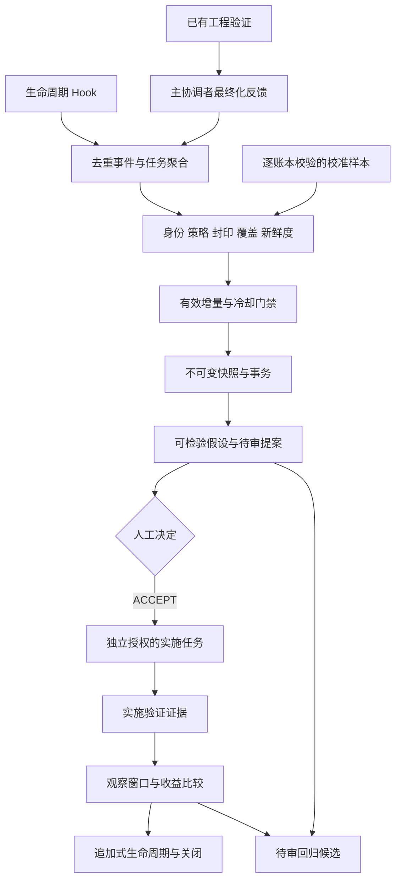

# 自观察与受控演进架构

状态：`active`。包版本 V7.6.0；事件继续使用 TaskOutcomeEvent V3；默认策略为 `v7.4.3-default-1`。源码 `runtime/cp_runtime/evolution/` 是唯一权威实现。

## 合同与模块

| 模块 | 职责 |
| --- | --- |
| artifacts / task_feedback | 有界不可变产物、复合任务身份、机械验证与主协调者最终化 |
| health / observation | 身份、策略、链和封印、覆盖率、新鲜度与信号门槛 |
| incremental | 项目锁、记录级输入清单、幂等事务、提交水位、显式自动化与失败重试状态 |
| calibration_sources / delegation_calibration | 每条样本核验自己的预算账本，按相同场景与独立任务比较 |
| hypothesis / snapshots / benefits | 冻结指标目标、带哈希的观察证据、基线及观察窗口比较 |
| governed / registry | 决策、实施关联、验证、收益观察和终态的确定性重放 |
| regression_assets | 根因候选与同类失败后续观察，不执行候选代码 |

## 数据与身份

数据位于仓库外项目上下文，必须匹配 project_id 与 repo_fingerprint。Profile 与 Hook 共用原始路径、Remote 字符串哈希；历史事件保持原字节。session/turn/task/工作树共同绑定反馈；观察快照使用 session 哈希代号。逐事件保留来源、记录身份、行游标和哈希，分段链直接使用验证后的来源信息。

JSONL、最终反馈、验证证据、快照与收益报告均有读取边界。坏行、哈希失败、身份串线、引用不一致和符号链接失败关闭。Hook 不保存原始 Prompt、回答、命令、输出、代码、Diff 或凭据。验证命令由当前工程任务授权；自动分析只读业务仓库并写仓库外观察产物。

## 增量与闭环

自动化默认禁用。启用后，SessionEnd worker 完成封印再检查健康与增量；没有有效变化时不制造新快照。锁内先发布事务、快照和候选，再原子提交 receipt；损坏与中断不推进水位。状态变化与新候选通过 notification_required 表达，运行时不直接发送消息。

新提案 schema 2.0 带不可变假设与基线。ACCEPTED → IMPLEMENTATION_LINKED → VALIDATION_RECORDED 后可追加多个收益观察，样本不足继续等待。只有最新收益 SUPPORTED 才能 CLOSED/PASS；NOT_SUPPORTED 或 REGRESSED 可关闭为 FAILED。取消与回滚有独立前置条件，终态不可追加。登记与重放均重新核验文件、哈希、任务、提交、时间窗口和质量底线。

## 统计解释与授权

档位和 Reviewer 比较共用角色、职责、难度、风险、上下文分组；每个独立任务等权，保留区间与质量损害指标。困难任务比例不同不构成直接改档依据。旧 Reviewer 总体代理仅为诊断，新候选使用核验后的场景比较。收益是观察关联，不宣称因果。

旧提案及生命周期保持原合同与哈希，不能将“旧关闭成功”解释为“新收益已证实”。所有提案永久保持 execution_authorization=NONE；人工 ACCEPT 不能授予修改、提交、发布、删除或生产权限。候选回归资产必须在独立授权任务中实现，跨项目晋升单独审核。

操作入口、状态码与示例见 [受控演进操作手册](CONTROLLED_EVOLUTION_OPERATIONS.md)。
