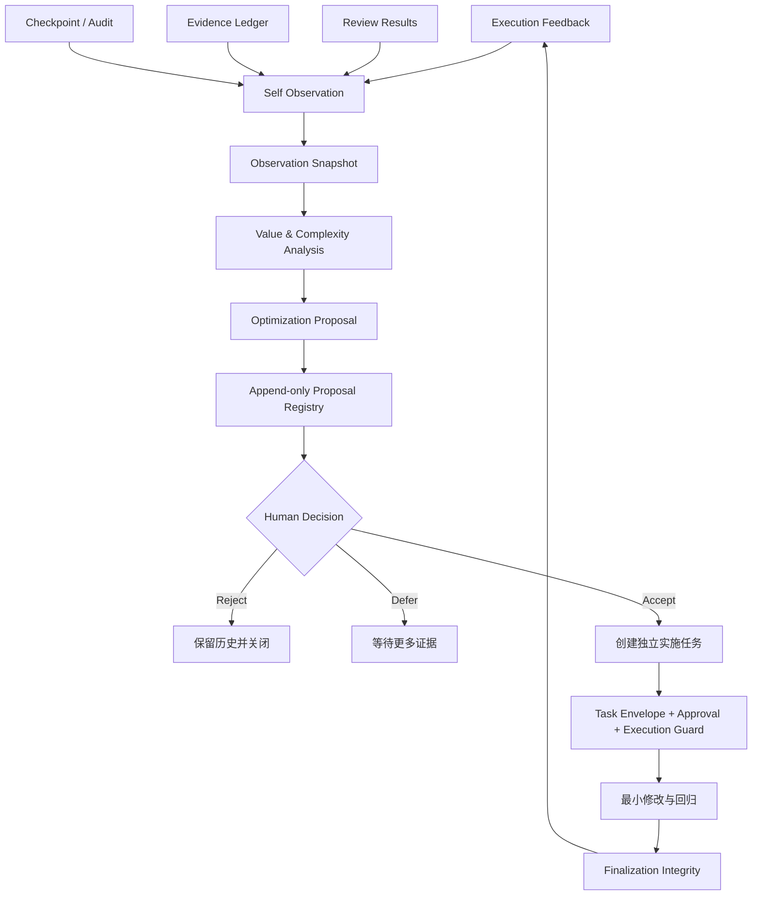

# V7.4 当前自观察与受控演进架构

> 状态：`active`。本页描述 V7.4.3 当前行为；Evolution 组件 Manifest 的 `5.1.0` 和默认策略 `v6.5-default-1` 是内部合同版本。

## 1. 设计目标

当前机制不允许 Agent 任意重写自身，而是建立一条可审计、可停止、可回滚的优化决策链：



## 2. 唯一权威实现

```text
runtime/cp_runtime/evolution/
├── contracts.py      # 不可变合同、枚举、哈希
├── redaction.py      # 敏感字段脱敏
├── storage.py        # 安全路径、原子写入、哈希链
├── observation.py    # 结构化自观察
├── analysis.py       # 确定性价值/复杂度分析
├── proposal.py       # 优化提案生成
├── registry.py       # 提案与人工决策注册表
├── service.py        # Observation → Analysis → Proposal 编排
├── cli.py            # 命令行接口
└── manifest.json     # 能力与禁止边界
```

其他 Skill、文档和脚本只能调用该目录，不能复制第二套合同和状态解释。

## 3. 输入边界

默认只读取项目上下文目录中允许的 JSONL：

```text
~/.codex/project-context/<project-id>/
```

允许的数据类型包括：

- execution feedback；
- review results；
- evidence events；
- checkpoint events；
- audit/outcome records。

默认排除：

- evolution 自己产生的 proposal、decision、snapshot 和 assessment；
- 超过深度与数量上限的文件；
- 项目上下文目录外文件；
- 符号链接；
- 损坏 JSONL；
- 超过大小或记录数限制的数据源。

任意一行损坏都会失败关闭，禁止跳过坏行后继续形成结论。

## 4. 观察指标

当前运行时能够确定性聚合：

- 已知结果成功率与非成功率；
- 批准派发档位的结果价值与单位成本；
- Skill 路由偏差率；
- 平均修复轮次和高修复任务占比；
- 重复失败类型及独立任务数；
- Reviewer 调用量、发现数和单位调用发现率；
- Skill 使用记录；
- 数据源数量、观察窗口和缺少 Task ID 的记录。

没有真实数据的字段不会被推断。无法确认“某能力本应被调用但未调用”时，不会仅凭 `usageCount=0` 自动生成退役提案。

V7.4 按信号分别评估证据充足性：派发档位价值回归依赖相邻批准档位的结果与单位成本样本，负面结果依赖已知终态覆盖，路由偏差依赖明确路由观察，Reviewer 收益依赖稳定身份与归因覆盖。某个信号证据不足时只阻断该信号，不无条件否决其他证据充分的候选。

## 5. 置信度

| 等级 | 含义 |
|---|---|
| L0 | 没有可用证据 |
| L1 | 单次或弱信号，只保留观察 |
| L2 | 至少两个独立任务形成有限证据 |
| L3 | 达到最小样本和多任务一致性，可生成受控修改或调查候选 |
| L4 | 长窗口、多来源、足够独立任务形成稳定证据 |

只有 L3/L4 信号可以直接形成 `MODIFY` 候选。L2 默认只能形成调查类建议。

`DEPRECATE` 还必须同时满足：

- 至少 20 次调用；
- 至少 30 天观察窗口；
- 至少 20 个独立任务；
- 至少两个数据源；
- 零有效发现；
- L4 置信度。

即使满足，也只会生成“先降为按需、进入观察期”的退役候选，不会自动删除 Reviewer。

## 6. 提案合同

每个提案必须包含：

- Project ID；
- Assessment ID；
- 稳定 Fingerprint；
- 问题和目标资源；
- Evidence Reference；
- 价值、复杂度、风险和置信度；
- 推荐动作；
- 预期收益；
- 回滚计划；
- 验证计划；
- 禁止边界；
- `execution_authorization = NONE`；
- `status = PENDING_REVIEW`。

提案 Fingerprint 用于阻止同一项目、同一问题和同一策略产生多个活跃副本。

## 7. 决策与执行分离

决策事件只允许：

```text
ACCEPT
REJECT
DEFER
```

每个决策必须记录明确 Actor 和不少于 10 个字符的理由。

`ACCEPT` 不会改变提案中的 `execution_authorization`，也不会调用任何修改函数。当前 CLI 没有 `execute`、`apply`、`autofix` 或 `auto-accept` 子命令。

## 8. 完整性

`proposals.jsonl` 和 `decisions.jsonl` 使用追加式哈希链：

```text
sequence
previous_hash
recorded_at
payload
record_hash
```

读取时验证：

- sequence 连续；
- previous_hash 相连；
- record_hash 与实际内容一致；
- Proposal/Decision 自身 content_hash 一致；
- Project ID 与注册表一致；
- Decision 引用的 Proposal 存在。

发现篡改或损坏后立即停止，不会自动修复历史。

## 9. 安全边界

- 存储路径必须位于仓库外项目上下文；
- 拒绝 `..`、绝对路径和符号链接；
- 写入采用同目录临时文件、fsync 和 `os.replace`；
- 注册表采用锁文件和追加写；
- 密钥、Token、Cookie、私钥和连接串在持久化前脱敏；
- 所有策略字段采用白名单，未知字段失败；
- 系统没有网络调用、模型调用和业务仓库写入接口。

## 10. 组件合同与包版本

当前包版本 V7.4.3 继续使用以下基础执行合同：

```text
Project Profile / Project State
Task Envelope V2
Approval
Evidence Freshness
Review Packet
Checkpoint / Memory Projection
Finalization Integrity
```

Evolution 组件在此基础上提供：

```text
Observation
Analysis
Proposal
Human Decision Registry
```

真正实施被接受的提案时，必须重新进入当前任务执行链，而不是由 Evolution Runtime 越权执行。组件合同版本用于兼容已有状态和数据，不代表网站或安装包仍停留在旧版本。
