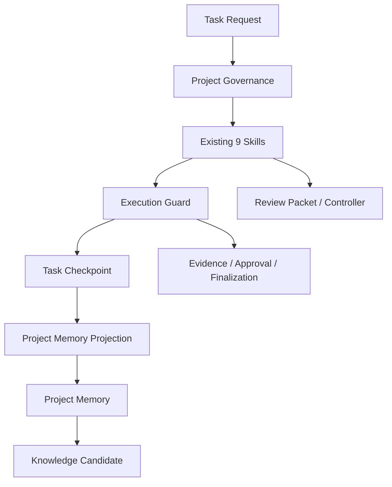

# V5.0 Project Governance and Evidence Closure Design

## 1. Architectural Role

V5.0 does not build a complete organizational governance layer. It adds three lightweight planes around the V4.2 engineering execution plane:



- Governance defines project identity, scope, and constraints; it does not execute production actions.
- Skills, Execution Guard, and Review Controller govern engineering execution.
- Evidence proves observations and grants no permission.
- Approval constrains actions and does not prove success.
- Finalization reads actual state and prevents delivery wording from exceeding evidence.
- Checkpoint, Project Memory, and Knowledge occupy separate fact layers.

## 2. Six-Dimensional Routing

V5.0 separates:

| Dimension | Purpose |
|---|---|
| Complexity `L0-L4` | Problem scope, context scale, and reasoning complexity |
| Project Stage | Unonboarded, onboarding, active, paused, or archived |
| Execution Profile | Authorization, validation, rollback, and delivery gates |
| Reviewer Budget | Reviewer count, rounds, and cost |
| Model Profile | Subagent model and reasoning effort |
| Host Surface | Main session, subagent, worktree, MCP, or long-running task |

Do not map them mechanically. A one-line production configuration may be `L1 + STRICT + terra-high`, while a large read-only architecture analysis may be `L3 + STANDARD + terra-medium`.

## 3. Project Profile and Project State

### 3.1 Project Profile

Stores slowly changing facts:

- project ID, repository path, and remote;
- languages, frameworks, build tools, and module markers;
- build, test, and startup entries with confidence;
- environment, data boundaries, and prohibited paths;
- confirmed facts, unknowns, and last validation time.

The Profile has an integrity hash and stable `binding_sha256`. Volatile timestamps do not invalidate every task. A real project-identity or boundary change requires rebinding old tasks.

### 3.2 Project State

Stores faster-changing state:

- project stage;
- current Git baseline;
- current task;
- risks, blockers, and one next action;
- latest checkpoint.

Project-ID mismatch between Profile and State fails closed.

## 4. Task Envelope V2

Binding chain:

```text
Project Profile
  -> Project State
  -> Task ID
  -> Git Baseline
  -> Routing
  -> Gates
  -> Approval
  -> Evidence
  -> Actions
  -> Finalization
```

`execution_guard.py` retains V4.2 commands and adds:

- `--project-profile`, `--project-state`, and `--project-id`;
- `--complexity`, `--project-stage`, and `--reviewer-budget`;
- `--model-profile`, `--host-surface`, and `--environment`;
- `authorize-action`;
- `record-action`;
- `finalize`.

## 5. Fact-Source Boundaries

| Object | Authoritative Owner |
|---|---|
| Skills, Reviewers, version | `manifest.json` |
| Project identity | `project-profile.json` |
| Current project state | `project-state.json` |
| Task phase, gates, and actions | `execution-state.json` |
| Review scheduling | `review-state.json` |
| Review input baseline | Review Packet Manifest |
| Task recovery | `CURRENT_TASK.md` + `PROGRESS.md` |
| Long-lived project facts | Reviewed `project-memory.md` |
| Cross-project experience | Knowledge Candidate Registry |

Other Markdown is explanation, template, or projection and cannot overwrite machine state.

## 6. Fail-Closed Cases

Block or downgrade to `NOT_CAPTURED` when:

- Profile disagrees with the actual repository;
- project ID or task ID differs;
- the Profile binding hash changes;
- Approval expired, was consumed, crosses environments, or baseline changed;
- the repository fingerprint bound to Evidence changes;
- a Finalization claim exceeds readback;
- a checkpoint enters Project Memory without review;
- one project's experience attempts to become Active Knowledge automatically.

## 7. Non-Goals

- No operating-system or cloud-platform permission isolation.
- No automatic model calls, MCP actions, Git push, deployment, or restart.
- No automatic promotion of project inference to confirmed facts.
- No Portfolio, Investment, or complete Capability lifecycle.
- No loading every project rule into context at once.
- No substitution of checker success for business acceptance or production gates.
