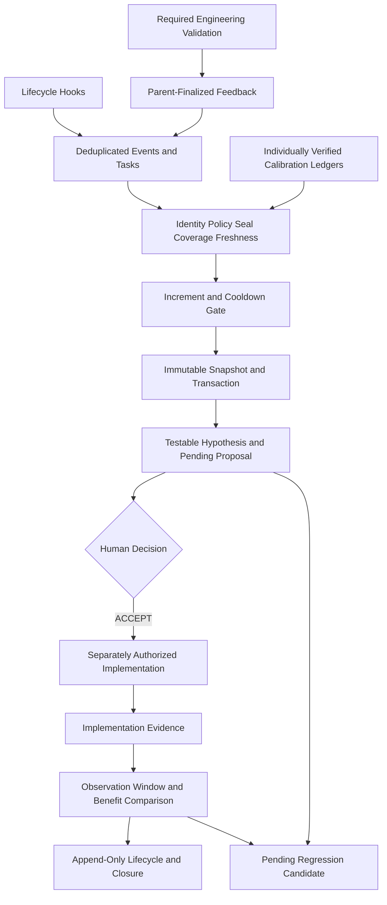

# V7.5 Self-Observation and Controlled Evolution Architecture

Status: `active`. Package V7.6.0 retains TaskOutcomeEvent V3 and uses default policy `v7.4.3-default-1`. The sole authoritative implementation is runtime/cp_runtime/evolution/.

## Contracts and modules

| Module | Responsibility |
| --- | --- |
| artifacts / task_feedback | Bounded immutable artifacts, composite task identity, mechanical evidence and parent finalization |
| health / observation | Identity, policy, chains, seals, coverage, freshness and signal gates |
| incremental | Project lock, record input manifest, idempotent transaction, watermark, opt-in automation and retry state |
| calibration_sources / delegation_calibration | Verify every sample against its own ledger; compare matching scenarios and independent tasks |
| hypothesis / snapshots / benefits | Frozen targets, hashed observation evidence, baseline and follow-up comparisons |
| governed / registry | Deterministic replay of decisions, links, validation, benefit observation and terminal state |
| regression_assets | Confirmed-cause candidates and recurrence follow-ups, without executing candidate code |

## Data and identity

Repository-external project context must match project_id and repo_fingerprint. Profile and Hook share the raw path/remote string hash; historical bytes are unchanged. Session, turn, task and worktree jointly bind feedback, while snapshots use hashed session aliases. Per-event provenance includes source, record identity, line cursor and hash, taken directly from the verified segmented chain.

JSONL, finalized feedback, validation, snapshots and benefit reports have bounded reads. Bad lines, hash failures, identity mismatches, invalid references and symlinks fail closed. Hooks retain no raw prompts, answers, commands, output, code, diffs or credentials. Validation commands are authorized by the engineering task; automatic analysis only reads business repositories and writes external observation artifacts.

## Incremental closed loop

Automation is disabled by default. Enabled projects run health and incremental checks only after the SessionEnd worker completes sealing. Unchanged input creates no new snapshot. Under a project lock, publish transaction, snapshot and candidates before atomically committing the receipt. Corruption and interruption do not advance the watermark. Meaningful changes and new candidates use notification_required; runtime sends no external messages.

New proposal schema 2.0 freezes a hypothesis and baseline. After ACCEPTED → IMPLEMENTATION_LINKED → VALIDATION_RECORDED, multiple benefit observations may be appended while insufficient evidence waits. Only latest SUPPORTED benefit permits CLOSED/PASS; NOT_SUPPORTED or REGRESSED may close as FAILED. Cancellation and rollback have distinct prerequisites. Terminal states reject further observations. Both registration and replay revalidate files, hashes, task, commit, windows and quality guardrails.

## Statistical interpretation and authority

Profile and Reviewer comparisons share role, responsibility, difficulty, risk and context stratification with equal task weighting, intervals and harm metrics. Different proportions of difficult tasks do not directly justify route changes. Legacy reviewer-wide proxies are diagnostic; new candidates use verified scenario comparisons. Benefit is observational association, not causal proof.

Historical proposals and lifecycle retain original contracts and hashes. Historical successful closure is not proof of measured benefit. All proposals permanently retain execution_authorization=NONE. Human ACCEPT does not grant modification, commit, release, deletion or production authority. Materialize regression candidates in separate authorized tasks; cross-project promotion requires separate review.

See the [operations manual](CONTROLLED_EVOLUTION_OPERATIONS.md) for commands and status codes.
