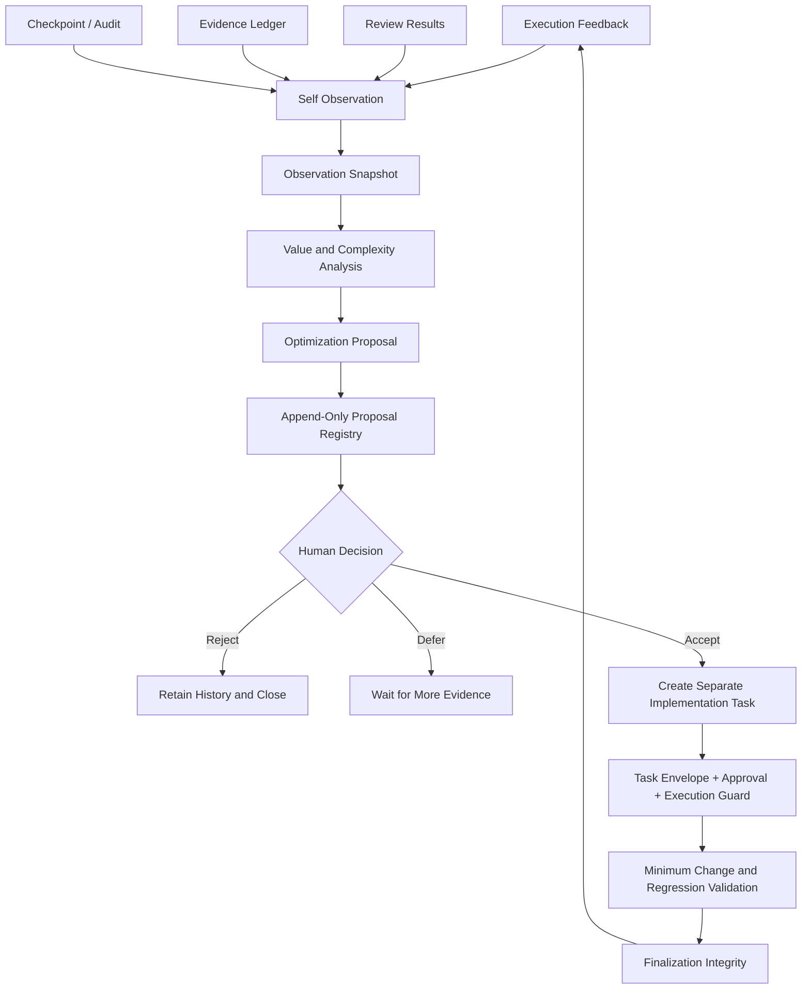

# V7.4 Current Self-Observation and Controlled Evolution Architecture

> Status: `active`. This page describes current V7.4.1 behavior. `5.1.0` in the Evolution component manifest and the default policy `v6.5-default-1` are internal contract versions.

## 1. Design Objective

The current mechanism does not allow an agent to rewrite itself at will. It establishes an optimization decision chain that is auditable, stoppable, and reversible:



## 2. Single Authoritative Implementation

```text
runtime/cp_runtime/evolution/
├── contracts.py      # Immutable contracts, enums, and hashes
├── redaction.py      # Sensitive-field redaction
├── storage.py        # Safe paths, atomic writes, and hash chains
├── observation.py    # Structured self-observation
├── analysis.py       # Deterministic value and complexity analysis
├── proposal.py       # Optimization-proposal generation
├── registry.py       # Proposal and human-decision registries
├── service.py        # Observation -> Analysis -> Proposal orchestration
├── cli.py            # Command-line interface
└── manifest.json     # Capability and prohibition boundaries
```

Other Skills, documents, and scripts may call this directory, but must not duplicate its contracts or state interpretation.

## 3. Input Boundary

By default, the runtime reads only permitted JSONL files beneath the project context directory:

```text
~/.codex/project-context/<project-id>/
```

Permitted data types include:

- execution feedback;
- review results;
- evidence events;
- checkpoint events; and
- audit or outcome records.

The runtime excludes by default:

- proposals, decisions, snapshots, and assessments produced by evolution itself;
- files beyond depth or count limits;
- files outside the project context directory;
- symbolic links;
- corrupt JSONL; and
- sources beyond size or record-count limits.

Any malformed line causes fail-closed behavior. The runtime never skips a bad line and continues to form conclusions.

## 4. Observation Metrics

The current runtime can aggregate these metrics deterministically:

- success and non-success rates among known outcomes;
- escalation rate from recommended to actual model;
- Skill-routing deviation rate;
- average repair rounds and the share of high-repair tasks;
- repeated failure categories and independent-task counts;
- reviewer invocation count, finding count, and findings per invocation;
- Skill usage records; and
- source count, observation window, and records without task IDs.

Fields without real data are not inferred. If the runtime cannot establish that a capability should have been invoked, it does not generate a deprecation proposal from `usageCount=0` alone.

V7.4 evaluates evidence sufficiency per signal: model escalation depends on actual-model coverage, negative outcomes depend on known terminal outcomes, routing deviation depends on explicit routing observations, and Reviewer yield depends on stable identity and attribution coverage. Insufficient evidence for one signal blocks only that signal rather than unconditionally rejecting other well-supported candidates.

## 5. Confidence Levels

| Level | Meaning |
|---|---|
| L0 | No usable evidence |
| L1 | One occurrence or a weak signal; retain as observation only |
| L2 | Limited evidence from at least two independent tasks |
| L3 | Minimum sample size and multi-task consistency reached; may create a controlled modification or investigation candidate |
| L4 | Stable evidence from a long window, multiple sources, and enough independent tasks |

Only L3 or L4 signals may directly create a `MODIFY` candidate. L2 produces investigation guidance by default.

A `DEPRECATE` candidate additionally requires all of the following:

- at least 20 invocations;
- at least a 30-day observation window;
- at least 20 independent tasks;
- at least two data sources;
- zero valid findings; and
- L4 confidence.

Even then, the proposal only recommends changing the reviewer to on-demand use and beginning an observation period. It never deletes a reviewer automatically.

## 6. Proposal Contract

Every proposal must contain:

- Project ID;
- Assessment ID;
- stable fingerprint;
- problem statement and target resource;
- evidence references;
- value, complexity, risk, and confidence;
- recommended action;
- expected benefit;
- rollback plan;
- validation plan;
- prohibited boundaries;
- `execution_authorization = NONE`; and
- `status = PENDING_REVIEW`.

The proposal fingerprint prevents multiple active copies of the same issue and policy in one project.

## 7. Separation of Decision and Execution

Decision events allow only:

```text
ACCEPT
REJECT
DEFER
```

Every decision must identify an actor and include a reason of at least ten characters.

`ACCEPT` does not change the proposal's `execution_authorization` and does not call any mutation function. The current CLI has no `execute`, `apply`, `autofix`, or `auto-accept` command.

## 8. Integrity

`proposals.jsonl` and `decisions.jsonl` use append-only hash chains:

```text
sequence
previous_hash
recorded_at
payload
record_hash
```

Reads verify that:

- sequence numbers are continuous;
- `previous_hash` values link correctly;
- each `record_hash` matches the actual content;
- the proposal or decision `content_hash` is valid;
- the Project ID matches the registry; and
- a proposal referenced by a decision exists.

The runtime stops immediately after detecting tampering or corruption and does not repair history automatically.

## 9. Security Boundaries

- Storage paths must remain in the project context outside the repository.
- Reject `..`, absolute paths, and symbolic links.
- Write through a same-directory temporary file, `fsync`, and `os.replace`.
- Protect registries with a lock file and append-only writes.
- Redact keys, tokens, cookies, private keys, and connection strings before persistence.
- Allowlist every policy field and fail on unknown fields.
- The system exposes no network call, model call, or business-repository write interface.

## 10. Component contracts and package version

The current V7.4.1 package continues to use these foundational execution contracts:

```text
Project Profile / Project State
Task Envelope V2
Approval
Evidence Freshness
Review Packet
Checkpoint / Memory Projection
Finalization Integrity
```

The Evolution component adds:

```text
Observation
Analysis
Proposal
Human Decision Registry
```

Implementing an accepted proposal must re-enter the current task execution chain. Evolution Runtime is never authorized to execute it directly. Component contract versions preserve compatibility with existing state and data; they do not mean the website or installed package remains on an earlier release.
