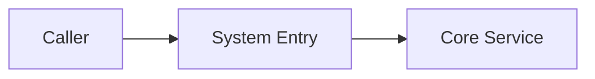
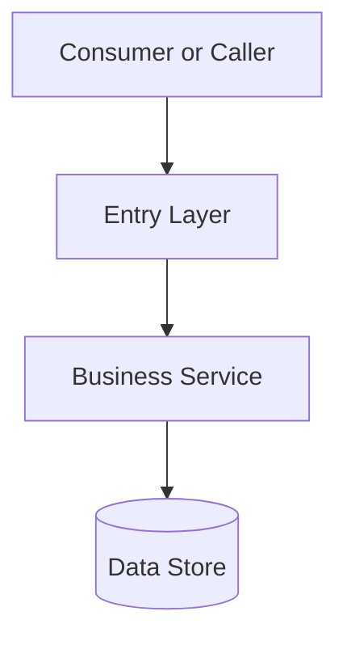

# System Architecture Design: <System Name>

## Document Information

- Version:
- Date:
- Applicable environments:
- Status:

## Executive Summary

## 1. Requirements and Constraints

### 1.1 Business Objectives

### 1.2 Account Scale and Capacity Targets

### 1.3 Non-Functional Constraints

### 1.4 Non-Goals

## 2. Business Flow

## 3. System Boundaries

## 4. Overall Architecture

## 5. Module and Service Responsibilities

| Module or Service | Responsibilities | Non-Responsibilities | Dependencies | Data Ownership |
|---|---|---|---|---|
|  |  |  |  |  |

## 6. Core Data and Consistency

## 7. Interfaces and Integrations

## 8. Cache, Messaging, Search, and Files

## 9. Authorization, Security, and Audit

## 10. Concurrency, Availability, and Failure Isolation

## 11. Observability

## 12. Deployment Topology

## 13. Capacity and Cost

## 14. Evolution Roadmap

## 15. Risks, Acceptance, and Rollback

## 16. Unverified Items
