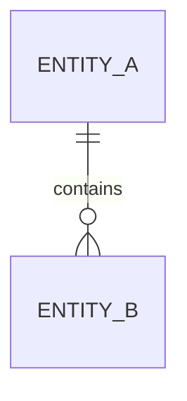

# Database Design: <Business Module>

## 1. Objectives and Scope

## 2. Business Objects and Data Ownership

## 3. Entity Relationships

## 4. Table Definitions

### 4.1 `<table_name>`

| Field | Type | Nullable | Default | Constraint | Description |
|---|---|---|---|---|---|
| id | bigint | No |  | PK | Primary key |

## 5. Index Design

| Index | Field Order | Type | Target Query | Notes |
|---|---|---|---|---|
|  |  |  |  |  |

## 6. Transactions, Locks, and Concurrency

## 7. Idempotency and Uniqueness

## 8. Data Lifecycle, Archival, and Audit

## 9. Migration and Historical Data

- New migration:
- Data backfill:
- Coexistence of old and new code:
- Table-lock and execution-plan risks:
- Rollback or compensation:

## 10. Performance and Capacity

## 11. Security and Sensitive Data

## 12. Validation Plan

## 13. Unverified Items
