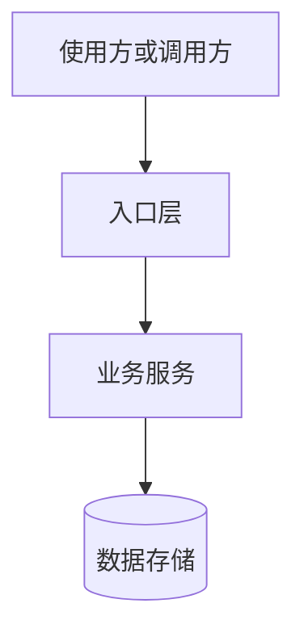

# 系统架构设计：<系统名称>

## 文档信息

- 版本：
- 日期：
- 适用环境：
- 状态：

## 执行摘要

## 一、需求与约束

### 1.1 业务目标

### 1.2 账户规模与容量目标

### 1.3 非功能约束

### 1.4 非目标

## 二、业务流程

## 三、系统边界

## 四、总体架构

## 五、模块与服务职责

| 模块或服务 | 负责内容 | 不负责内容 | 依赖 | 数据所有权 |
|---|---|---|---|---|
|  |  |  |  |  |

## 六、核心数据与一致性

## 七、接口与集成

## 八、缓存、消息、搜索与文件

## 九、权限、安全与审计

## 十、高并发、高可用与故障隔离

## 十一、可观测性

## 十二、部署拓扑

## 十三、容量与成本

## 十四、演进路线

## 十五、风险、验收与回滚

## 十六、未验证项
