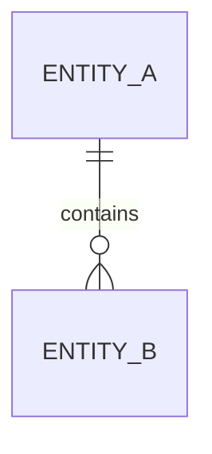

# 数据库设计：<业务模块>

## 一、设计目标与范围

## 二、业务对象与数据所有权

## 三、ER 关系

## 四、表结构

### 4.1 `<table_name>`

| 字段 | 类型 | 可空 | 默认值 | 约束 | 说明 |
|---|---|---|---|---|---|
| id | bigint | 否 |  | PK | 主键 |

## 五、索引设计

| 索引 | 字段顺序 | 类型 | 对应查询 | 说明 |
|---|---|---|---|---|
|  |  |  |  |  |

## 六、事务、锁与并发

## 七、幂等与唯一性

## 八、数据生命周期、归档与审计

## 九、迁移与历史数据

- 新增迁移：
- 数据回填：
- 新旧代码共存：
- 锁表和执行计划风险：
- 回滚或补偿：

## 十、性能与容量

## 十一、安全与敏感数据

## 十二、验证方案

## 十三、未验证项
